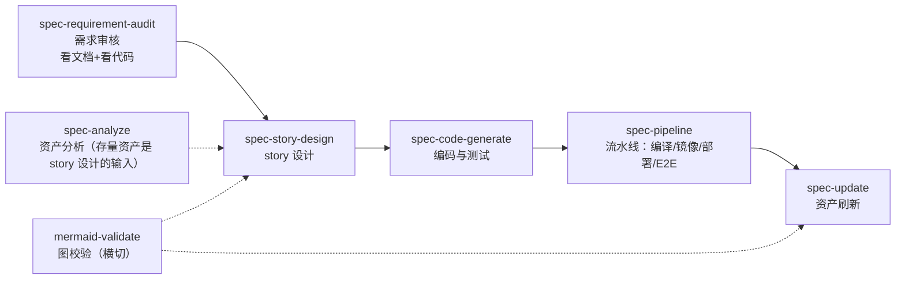
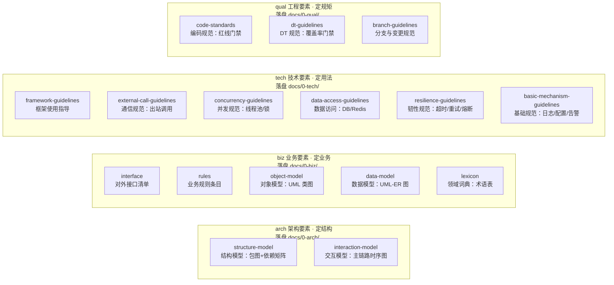
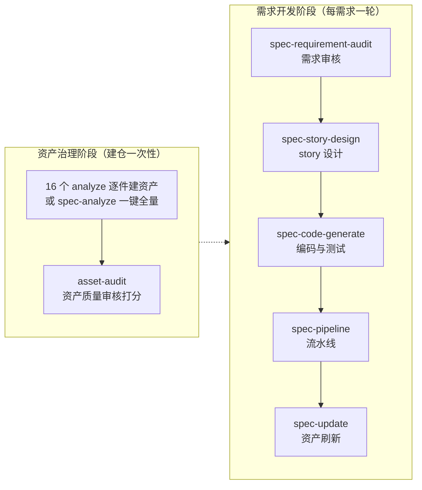
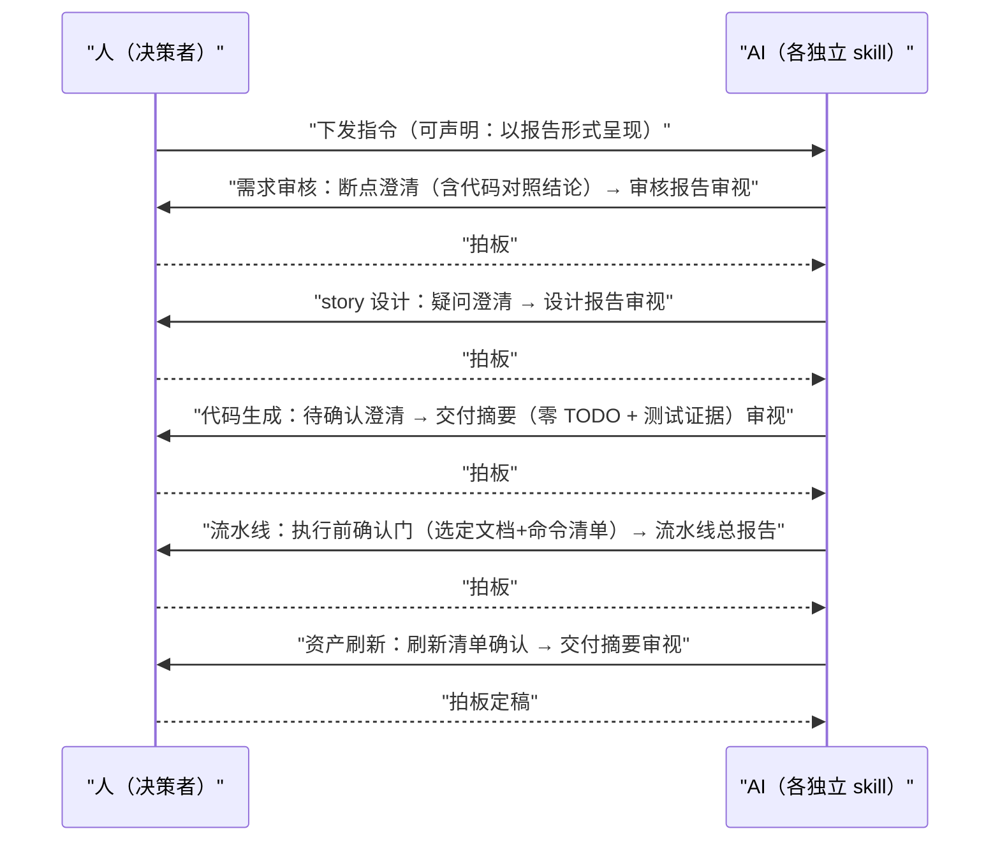

# Specgo

面向存量代码仓的四分类资产治理 skill 体系：**7 个独立 skill + 17 个子流程 + 17 个斜杠命令**，无编排层——各 skill 独立执行、按需串联。内置一段 bootstrap 注入指令，让 coding agent 在做代码仓分析类任务前先加载对应 skill、按四分类资产模型 taxonomy 与统一格式产出文档资产到 `docs/0-{域}/{资产}/` 下；并能依据 story 设计文档直接生成代码。

> 安装与卸载见 [INSTALL.md](./INSTALL.md)。
>
> **v3.0 breaking change**：specgo 编排层与 spec-admin 已移除（`/spec-init`、`/spec-index`、`/specgo-report` 命令不再存在）；spec-asset-audit 改名 asset-audit 并下放为 spec-analyze 子流程；需求审核改名 spec-requirement-audit 并新增代码对照；域/总索引（docs/README.md、docs/0-{域}/README.md）不再自动生成。

## 7 个独立 skill

全部对外暴露（进 skill 列表），**无命令，直接说人话即可触发**；所有 skill 遵循交互双模式——询问点默认用 ask-human 工具，任务开始时声明"以报告形式呈现"则全程只输出报告：

| Skill | 职责 | 主要产出 |
|-------|------|---------|
| `spec-analyze` | 资产分析：承载 17 个子流程（四域 16 个分析 + asset-audit 资产质量审核）的路由与全量编排（子代理并行建齐 docs/ 全套资产） | `docs/0-{域}/{资产}/` 全套资产 |
| `spec-requirement-audit` | 需求审核：看文档 + 看代码（代码对照：文档描述与代码事实比对、注入点/复用点初步定位），多彩建模 + 三类断点扫描 + 澄清闭环，收尾输出不落盘审核报告 | 源文档同目录：`{功能名}-建模结果.html` + `{功能名}-规范功能实现设计.md` |
| `spec-story-design` | story 设计：规范功能实现设计/需求文档 → 八类核心要素 delta 文档（标注新增/变更/不涉及），收尾输出不落盘设计报告 | `docs/1-storys/{功能名}/`：{功能名}-story.md + {功能名}-develop-task.md |
| `spec-code-generate` | 代码生成与本地自测试：零 TODO 完整实现；子代理只实现代码（按文件分组可并行），主代理执行单测/集成测试/验证命令 | 完整可运行的代码 + 测试（落被分析仓） |
| `spec-pipeline` | 流水线执行：递归查找项目内 pipeline-skill.md（多个时读前 5 行自选并告知理由），只开启一个子代理把整条流水线（编译/出镜像/部署/E2E）全部跑完，失败即停 | 不落盘流水线总报告 |
| `spec-update` | 资产刷新：基于 git 变更（工作区 diff / commit / MR diff）识别对 docs/ 资产的影响，按最新要素定义增量刷新（刷新清单人工确认后定稿） | 受影响 docs/ 文档就地刷新（同名覆盖） |
| `mermaid-validate` | mermaid 语法红线 + 本地渲染验证（横切工具，所有含图产出物必过） | 含图产出物跑 validate-mermaid.mjs 全部 VALID |

需求到交付的推荐串联（每步独立执行、收尾报告交人审视）：

## 子流程清单（spec-analyze 的 17 个子流程）

子流程是 spec-analyze 内 `references/subflows/*.md` 的执行剧本，由 spec-analyze 路由表加载，也可用**同名斜杠命令**（如 `/biz-interface-analyze`）直接触发。命名公式 `{域}-{资产}-{形态}-analyze`，输出统一落盘 `docs/0-{域}/{资产}/`（每类资产一个单独目录，活文档同名覆盖）。四域 16 件按域成列（图中节点省略公共前后缀 `{域}-` 与 `-analyze` / `-guidelines-analyze`）：

### 架构要素（arch）—— 定结构：代码往哪放

| 子流程 | 作用 | 产出 |
|-------|------|------|
| arch-structure-model-analyze | 结构模型：模块划分、分层、职责与依赖关系（UML 包图 + 依赖矩阵），提取型 | `docs/0-arch/structure-model/`：structure-model.md 仓级总览 + structure-model-{module}.md 每模块一篇 |
| arch-interaction-model-analyze | 交互模型：模块间主业务流程、消息走向（UML 时序图），只画主链路，分支逻辑归业务规则；未指明流程时默认全量逐篇产出 | `docs/0-arch/interaction-model/`：interaction-model-{flow}.md 每业务流程一篇 |

### 业务要素（biz）—— 定业务：对象怎么建、数据存什么

| 子流程 | 作用 | 产出 |
|-------|------|------|
| biz-interface-analyze | 接口：服务对外接口清单（HTTP 路由/RPC/消息订阅/IDL），按功能域聚类 | `docs/0-biz/interface/`：README 全景主文档 + interface-{feature}.md 每功能域一篇 |
| biz-rules-analyze | 业务规则：条件分支/参数校验/状态迁移/阈值/错误码等规则点，按需求类整理"条件 → 动作 + 依据"规则条目 | `docs/0-biz/rules/`：rules-{feature}.md 每需求类一篇 |
| biz-object-model-analyze | 对象模型：实体、值对象、聚合、领域服务、领域事件（UML 类图），只画聚合内结构与聚合间引用方向 | `docs/0-biz/object-model/`：object-model-{aggregate}.md 每聚合一篇 |
| biz-data-model-analyze | 数据模型：持久态表结构、缓存数据结构、字段关系与数据生命周期（UML-ER） | `docs/0-biz/data-model/`：data-model-{entity}.md 每数据实体一篇 |
| biz-lexicon-analyze | 领域词典：业务与代码共用的受控词汇集（术语释义、语境边界、代码命名映射），按功能域拆分子域文档 | `docs/0-biz/lexicon/`：主文档 lexicon.md（说明/待确认清单/子域导航/通用节）+ lexicon-{feature}.md 每功能域一篇 |

### 技术要素（tech）—— 定用法：机制怎么用、调用怎么跑

| 子流程 | 作用 | 产出 |
|-------|------|------|
| tech-framework-guidelines-analyze | 框架使用指导：基础框架清单与使用方式盘点（纯现状提取，无规范文档） | `docs/0-tech/framework-guidelines/`：README 索引 + framework-guidelines-{framework}.md 每框架一篇 |
| tech-external-call-guidelines-analyze | 通信规范：RPC/HTTP/MQ 跨服务调用指导（协议与封装归此，故障策略归韧性）；双模式：提取 + 差距分析 | `docs/0-tech/external-call-guidelines/`：README + external-call-guidelines-{service}.md 每外部服务一篇；差距报告 report/{YYYYMMDD}-external-call-guidelines.md |
| tech-concurrency-guidelines-analyze | 并发规范：线程池/锁/channel 等并发原语实例的用途定位、使用说明与代码案例（章节上限三节）；单模式提取 | `docs/0-tech/concurrency-guidelines/`：README 索引 + concurrency-guidelines-{pool}.md 每实例一篇 |
| tech-data-access-guidelines-analyze | 数据访问规范：Redis/DB 等中间件访问指导（连接管理、事务、分页批量、SQL 注入防护、缓存读写模式）；双模式 | `docs/0-tech/data-access-guidelines/`：data-access-guidelines-{mw}.md 每中间件一篇 + report/ |
| tech-resilience-guidelines-analyze | 韧性规范：超时/重试/熔断降级/异常处理等故障策略的使用说明与代码案例；单模式提取 | `docs/0-tech/resilience-guidelines/`：README 索引 + resilience-guidelines-{dimension}.md 每维度一篇 |
| tech-basic-mechanism-guidelines-analyze | 基础规范：日志/配置/告警等横切编码机制的使用指导（函数调用说明 + 使用代码案例）；单模式提取 | `docs/0-tech/basic-mechanism-guidelines/`：README 索引 + basic-mechanism-guidelines-{dimension}.md 每维度一篇 |

### 工程要素（qual）—— 定规矩：写到什么程度才算合格

| 子流程 | 作用 | 产出 |
|-------|------|------|
| qual-code-standards-analyze | 编码规范：命名、注释、函数长度/圈复杂度、安全编码红线、禁止项清单（规则分红线/建议两级，红线供 CI 门禁）；双模式 + 门禁 | `docs/0-qual/code-standards/`：code-standards.md 仓级单篇 + report/ 门禁差距报告 |
| qual-dt-guidelines-analyze | DT 规范：测试金字塔与覆盖基线、用例设计方法、自测报告要求、新增代码覆盖率门禁；双模式 + 门禁 | `docs/0-qual/dt-guidelines/`：dt-guidelines.md 仓级单篇 + report/ |
| qual-branch-guidelines-analyze | 分支与变更规范：分支模型、commit/MR 规范、评审要求；双模式 | `docs/0-qual/branch-guidelines/`：branch-guidelines.md 仓级单篇 + report/ |

### 资产质量审核（横向，归资产治理侧）

| 子流程 | 作用 | 产出 |
|-------|------|------|
| asset-audit | docs/{arch,biz,tech,qual}/ 资产两维度审核（表达质量 + 代码一致性），E/C 打分三档（已基线/待修订/重写）；范围支持指定单篇/增量（git 变更驱动）/总览/全量；不入 spec-analyze 全量编排波次，按需单独触发 | `docs/report/`：README.md 打分总览 + 每篇 `{文档基名}-audit.md`（镜像 docs/ 相对路径） |

## 推荐使用顺序

两个阶段，每步也可单独触发：

## 使用指导

### 人工环节一览（人只做两件事：下指令 + 过审视点）

链路各 skill 独立执行，人通过每个 skill 收尾的**不落盘报告**审视拍板；所有询问点默认用 ask-human 工具，任务开始时声明"以报告形式呈现"则全程只输出报告（交互双模式）：

### 逐项手动执行（人逐步触发）

> 四域 16 个子流程与 asset-audit 可用同名斜杠命令直接触发（如 `提取业务规则` 等价于 `/biz-rules-analyze`）；6 个其余顶层 skill 无命令，直接说人话触发。

**资产治理阶段**

第 1 步：逐项建资产，按需触发，可多次
输入指令示例：
`梳理代码仓结构`（结构模型）
`梳理全部业务流程`（交互模型时序图）
`盘点对外接口`（接口清单）
`提取业务规则`（规则条目）
`梳理对象模型`（领域类图）
`梳理表结构`（数据模型 ER 图）
`提取领域词典`（术语表）
`盘点框架使用指导`（技术栈）
`盘点出站调用`（通信规范）
`盘点线程池与并发原语`（并发规范）
`盘点数据访问方式`（数据访问规范）
`梳理超时重试与故障策略`（韧性规范）
`梳理日志/配置/告警使用`（基础规范）
`起草编码规范` / `起草 DT 规范` / `起草分支规范`（qual 三件套）

第 2 步：资产质量审核（可选）
输入指令：`评估 docs 文档质量`
（asset-audit：表达质量 + 代码一致性两维度打分，报告归档 docs/report/）

**需求开发阶段**

第 3 步：需求审核（可选但推荐）
输入指令：`审核这份需求文档的逻辑完备性：<需求文档路径>`
（spec-requirement-audit；看文档+看代码，产出建模 HTML 与规范功能实现设计，断点逐条拍板）

第 4 步：story 设计
输入指令：`按这份需求文档做 story 设计：<需求文档路径>`
（spec-story-design；产出 docs/1-storys/{功能名}/ 下 story + develop-task，develop-task 的疑问澄清逐条给结论）

第 5 步：编码实现与测试
输入指令：`按 docs/1-storys/{功能名}/ 的 develop-task 实现代码`
（spec-code-generate；零 TODO 完整实现，主代理实跑测试与验证命令取证）

第 6 步：流水线（可选）
输入指令：`跑流水线`
（spec-pipeline；查找项目内 pipeline-skill.md 并按其执行编译/出镜像/部署/E2E）

第 7 步：MR 合入后资产刷新
输入指令：`看看这次变更要刷新哪些 docs 文档`
（spec-update；刷新清单确认后定稿）

### 一键模式（精简）

**第一步：建仓资产（仅首次）**。说"对这个仓做全量资产分析"，spec-analyze 子代理并行建齐 docs/ 全套资产。

**第二步：需求开发（日常使用）**。把需求文档路径发给 AI，依次说"审核这份需求文档"→"做 story 设计"→"按 develop-task 实现代码"→"跑流水线"→"刷新 docs 资产"，每个 skill 收尾的报告审视拍板即可。
