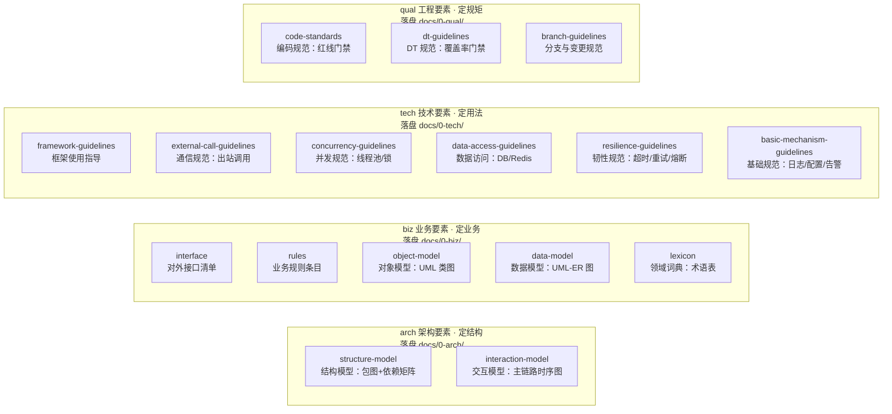
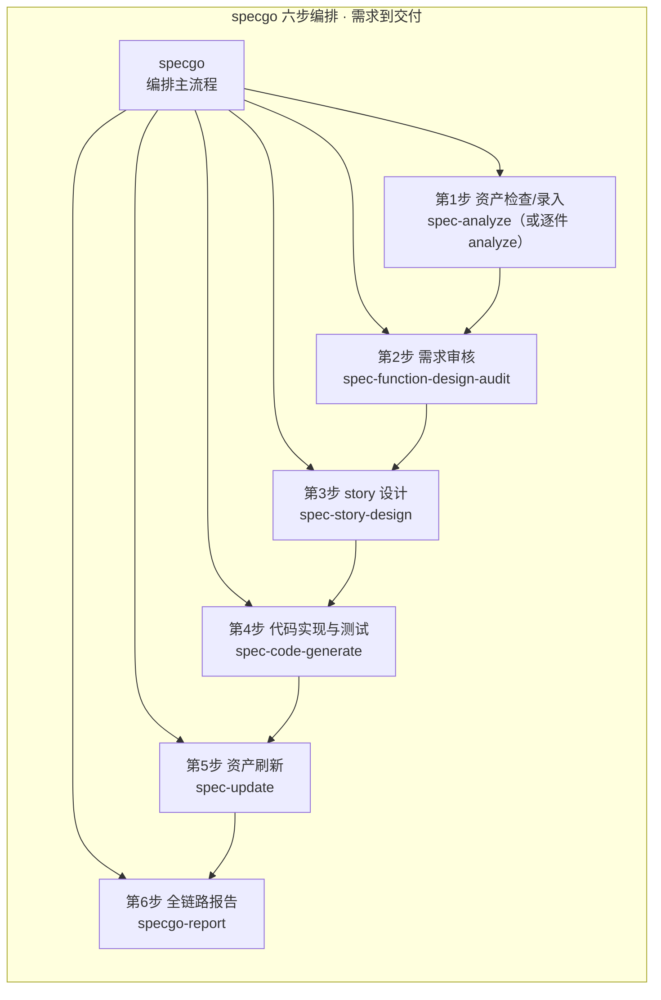
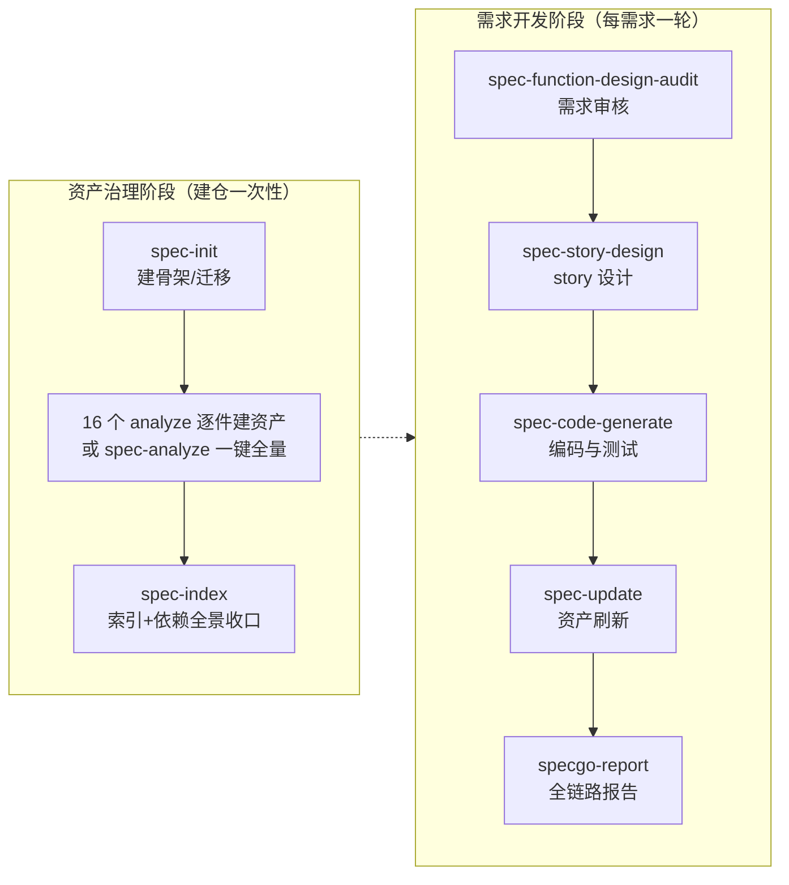
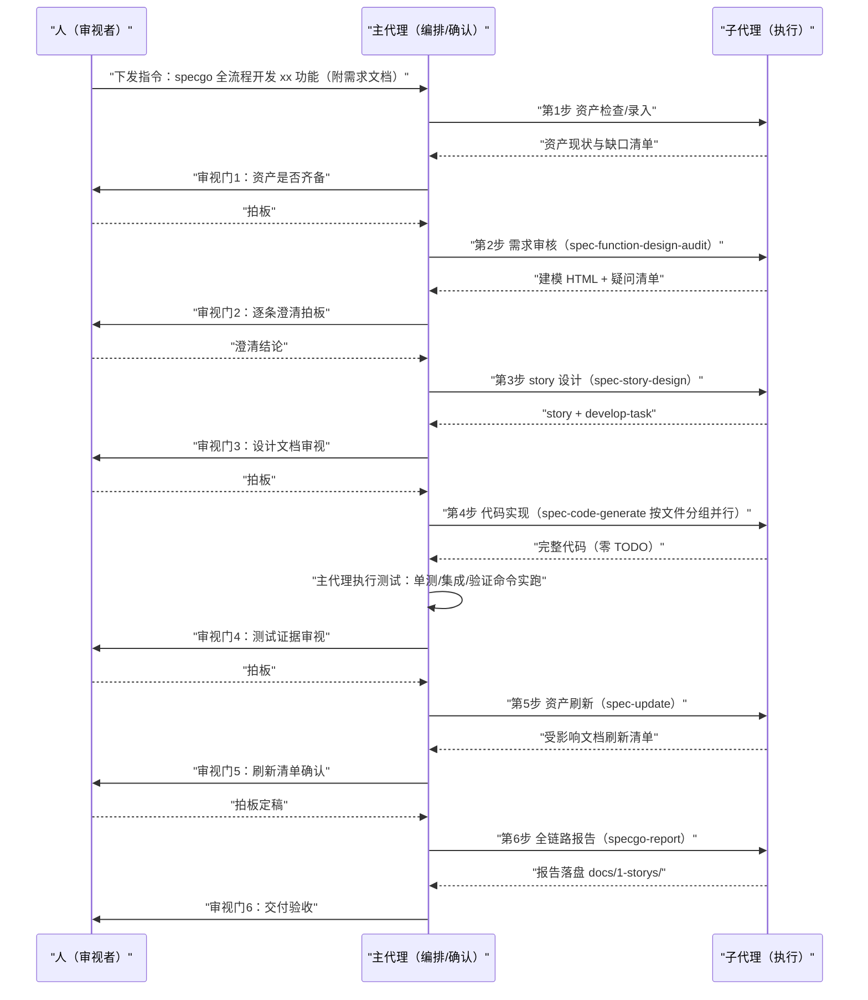

# Specgo

面向存量代码仓的四分类资产治理 skill 体系，共 27 个 skill：`arch` / `biz` / `tech` / `qual` 四域 16 个 + `spec` 系列 10 个（横向 6 个 + 需求到交付链路 3 个 + specgo 编排）+ 其它 1 个（mermaid-validate）。内置一段 bootstrap 注入指令，让 coding agent 在做代码仓分析类任务前先加载对应 skill、按 HELP.MD taxonomy 与统一格式产出文档资产到 `docs/0-{域}/{资产}/` 下；并能依据 story 设计文档直接生成代码。

## 设计要素全景

27 个 skill 按「四域资产 + spec 横向 + spec 链路 + 编排」组织。为便于扫读拆两张图：四域 16 件按域成列（节点省略公共前后缀 `{域}-` 与 `-analyze` / `-guidelines-analyze`，全名见下表）：

spec 系列 10 件 + 横切工具 mermaid-validate 共 11 件：specgo 把其中 6 件串成「需求到交付」六步链（第 1 步复用 spec-analyze 或逐件四域 analyze）；其余 5 件——spec-init（建骨架/旧布局迁移）、spec-index（索引+服务依赖全景）、spec-asset-audit（docs 资产质量审核）、mermaid-validate（图渲染校验）等——管建仓、资产审核与横切校验，不进交付链。

要点：四域 16 个 analyze skill 产出落盘 `docs/0-{域}/{资产}/`（每类资产一个单独目录，活文档同名覆盖）；specgo 编排六步、每步结束过一道 ask-human 审视门（人的参与方式见下方「人工环节一览」时序图）；spec-init / spec-index 只在建仓期使用，mermaid-validate 横切校验所有含图产出物。详细产出物清单见下表。

## 内含 skill

skill 清单按 HELP.MD「四分类资产模型」taxonomy 组织：四域（arch / biz / tech / qual）+ spec 系列（横向 / 链路 / 编排）+ 其它。命名公式 `{域}-{资产}-{形态}-analyze`，输出统一落盘 `docs/0-{域}/{资产}/`（每类资产一个单独目录）。

### 架构要素（arch）—— 定结构：代码往哪放

| Skill | 作用 | 产出 |
|-------|------|------|
| arch-structure-model-analyze | 结构模型：模块划分、分层、职责与依赖关系（UML 包图 + 依赖矩阵），提取型 | `docs/0-arch/structure-model/`：structure-model.md 仓级总览 + structure-model-{module}.md 每模块一篇 |
| arch-interaction-model-analyze | 交互模型：模块间主业务流程、消息走向（UML 时序图），只画主链路，分支逻辑归业务规则；未指明流程时默认全量逐篇产出 | `docs/0-arch/interaction-model/`：interaction-model-{flow}.md 每业务流程一篇 |

### 业务要素（biz）—— 定业务：对象怎么建、数据存什么

| Skill | 作用 | 产出 |
|-------|------|------|
| biz-interface-analyze | 接口：服务对外接口清单（HTTP 路由/RPC/消息订阅/IDL），按功能域聚类 | `docs/0-biz/interface/`：README 全景主文档 + interface-{feature}.md 每功能域一篇 |
| biz-rules-analyze | 业务规则：条件分支/参数校验/状态迁移/阈值/错误码等规则点，按需求类整理"条件 → 动作 + 依据"规则条目 | `docs/0-biz/rules/`：rules-{feature}.md 每需求类一篇 |
| biz-object-model-analyze | 对象模型：实体、值对象、聚合、领域服务、领域事件（UML 类图），只画聚合内结构与聚合间引用方向 | `docs/0-biz/object-model/`：object-model-{aggregate}.md 每聚合一篇 |
| biz-data-model-analyze | 数据模型：持久态表结构、缓存数据结构、字段关系与数据生命周期（UML-ER） | `docs/0-biz/data-model/`：data-model-{entity}.md 每数据实体一篇 |
| biz-lexicon-analyze | 领域词典：业务与代码共用的受控词汇集（术语释义、语境边界、代码命名映射），按功能域拆分子域文档 | `docs/0-biz/lexicon/`：主文档 lexicon.md（说明/待确认清单/子域导航/通用节）+ lexicon-{feature}.md 每功能域一篇 |

### 技术要素（tech）—— 定用法：机制怎么用、调用怎么跑

| Skill | 作用 | 产出 |
|-------|------|------|
| tech-framework-guidelines-analyze | 框架使用指导：基础框架清单与使用方式盘点（纯现状提取，无规范文档） | `docs/0-tech/framework-guidelines/`：README 索引 + framework-guidelines-{framework}.md 每框架一篇 |
| tech-external-call-guidelines-analyze | 通信规范：RPC/HTTP/MQ 跨服务调用指导（协议与封装归此，故障策略归韧性）；双模式：提取 + 差距分析 | `docs/0-tech/external-call-guidelines/`：README + external-call-guidelines-{service}.md 每外部服务一篇；差距报告 report/{YYYYMMDD}-external-call-guidelines.md |
| tech-concurrency-guidelines-analyze | 并发规范：线程池/锁/channel 等并发原语实例的用途定位、使用说明与代码案例（章节上限三节）；单模式提取 | `docs/0-tech/concurrency-guidelines/`：README 索引 + concurrency-guidelines-{pool}.md 每实例一篇 |
| tech-data-access-guidelines-analyze | 数据访问规范：Redis/DB 等中间件访问指导（连接管理、事务、分页批量、SQL 注入防护、缓存读写模式）；双模式 | `docs/0-tech/data-access-guidelines/`：data-access-guidelines-{mw}.md 每中间件一篇 + report/ |
| tech-resilience-guidelines-analyze | 韧性规范：超时/重试/熔断降级/异常处理等故障策略的使用说明与代码案例；单模式提取 | `docs/0-tech/resilience-guidelines/`：README 索引 + resilience-guidelines-{dimension}.md 每维度一篇 |
| tech-basic-mechanism-guidelines-analyze | 基础规范：日志/配置/告警等横切编码机制的使用指导（函数调用说明 + 使用代码案例）；单模式提取 | `docs/0-tech/basic-mechanism-guidelines/`：README 索引 + basic-mechanism-guidelines-{dimension}.md 每维度一篇 |

### 工程要素（qual）—— 定规矩：写到什么程度才算合格

| Skill | 作用 | 产出 |
|-------|------|------|
| qual-code-standards-analyze | 编码规范：命名、注释、函数长度/圈复杂度、安全编码红线、禁止项清单（规则分红线/建议两级，红线供 CI 门禁）；双模式 + 门禁 | `docs/0-qual/code-standards/`：code-standards.md 仓级单篇 + report/ 门禁差距报告 |
| qual-dt-guidelines-analyze | DT 规范：测试金字塔与覆盖基线、用例设计方法、自测报告要求、新增代码覆盖率门禁；双模式 + 门禁 | `docs/0-qual/dt-guidelines/`：dt-guidelines.md 仓级单篇 + report/ |
| qual-branch-guidelines-analyze | 分支与变更规范：分支模型、commit/MR 规范、评审要求；双模式 | `docs/0-qual/branch-guidelines/`：branch-guidelines.md 仓级单篇 + report/ |

### spec 系列（横向 + 需求到交付链路 + 编排）

横向 6 件管 docs/ 资产的生命周期、质量审核与交付报告（建骨架、索引、刷新、一键全量、资产质量审核、全链路报告）；链路 3 件 + specgo 编排支撑"需求审核 → story 设计 → 代码生成"的需求到交付链路。

| Skill | 作用 | 产出 |
|-------|------|------|
| spec-init | 初始化仓级 `docs/` 资产目录骨架（每类资产一个单独目录），一次性迁移既有产出到新布局（迁移映射清单先交用户确认） | 目录骨架 + 迁移执行摘要 |
| spec-index | 生成各域索引 README + 总索引 + 服务依赖全景图（Mermaid flowchart，从通信规范资产提取依赖边）；只聚合真实存在的文件 | `docs/README.md` 总索引 + 各域 `docs/0-{域}/README.md` |
| spec-update | 基于 git 变更（工作区 diff / commit / MR diff）识别代码变化对 docs/ 资产的影响，按最新要素定义增量刷新受影响文档（刷新清单人工确认后定稿） | 受影响 docs/ 文档就地刷新（同名覆盖） |
| spec-analyze | 一键全量资产分析编排：子代理并行派发全部 16 个 analyze skill（词典第二波复用接口功能域口径），spec-index 收口索引；主代理只编排、确认与验收 | `docs/` 全套资产 + 各域索引与总索引 |
| spec-story-design | 需求文档 → story 设计文档（八类核心要素组织，标注新增/变更/不涉及）；每 story 一个目录 | `docs/1-storys/{功能名}/`：{功能名}-story.md + {功能名}-develop-task.md（抛弃式编码辅助文档） |
| spec-function-design-audit | 需求/功能设计审核：多彩建模 + 三类断点扫描（表述质量/逻辑断点/设计要素）+ ask-human 批量澄清 + HTML，可选输出规范功能设计 md | 源文档同目录：`{功能名}-建模结果.html`；可选 `{功能名}-功能设计.md` |
| spec-asset-audit | 四类资产质量审核：docs/{arch,biz,tech,qual}/ 资产两维度审核（表达质量 + 代码一致性），结论三档（失实/待修订/可信）；范围支持指定单篇/增量（git 变更驱动，默认）/全量 | `docs/report/`：README.md 总览 + 每篇 `{文档基名}-audit.md`（镜像 docs/ 相对路径） |
| specgo | 全链路编排：资产检查/录入 → 需求审核 → story 设计 → 代码实现与测试 → 资产刷新（spec-update）→ 全链路分析报告（specgo-report），六步端到端；每步校验环节结束固定过 ask-human 审视门；主代理编排与用户确认，各步骤派子代理执行 | 从需求到交付的全部产出物 |
| specgo-report | 需求到代码全链路分析报告：三节结构（测试用例执行结果 + 代码修改清单含「业务规则」列 + 引用资产质量评估与清单同口径），由 specgo 第 6 步调度或单独触发 | `docs/1-storys/{功能名}/{YYYYMMDD}-report.md` |
| spec-code-generate | 代码生成执行：两条铁律（完整代码零 TODO；子代理只实现代码、按文件分组可并行多个，主代理执行测试与后续流程）+ 子代理三步纪律（三波文档 → 定点核实 → 按清单落地）+ 主代理四步测试验收（组装与零 TODO 复核 → 单测 → 集成测试主动跑 → 验证命令实跑），由 specgo 第 4 步调度或单独触发 | 完整可运行的代码 + 测试（落被分析仓） |

### 其它

| Skill | 作用 | 产出 |
|-------|------|------|
| mermaid-validate | mermaid 语法红线 + 本地渲染验证 | 含图产出物跑 validate-mermaid.mjs 全部 VALID |

## 推荐使用顺序（spec 系列）

两个阶段、两条流水线，每步也可单独触发：

资产质量审核随时走 spec-asset-audit；也可直接加载 specgo 走六步端到端编排主流程（自动串联 G2 各步，子代理执行）。

## 使用指导

### 人工环节一览（人只做两件事：下指令 + 过审视门）

以 specgo 六步编排为例，执行全部派给子代理，人在每步校验环节的 ask-human 审视门拍板，不通过就打回重做：

逐 skill 手动执行（方式一）时同理：每个 skill 产出后由人审视确认再进下一步；子代理只执行、主代理只编排与测试、人只决策。

### 方式一：逐 skill 手动执行（人逐步触发）

**资产治理阶段**

第 1 步：初始化 docs/ 目录骨架（仅首次）
输入指令：`初始化 docs 目录骨架`
（spec-init；有旧文档时会先给迁移映射清单，确认后才动手）

第 2 步：逐项建资产，按需触发，可多次
输入指令示例：
`梳理代码仓结构`（结构模型）
`梳理全部业务流程`（交互模型时序图）
`盘点对外接口`（接口清单）
`提取业务规则`（规则条目）
`梳理对象模型`（领域类图）
`梳理表结构`（数据模型 ER 图）
`提取领域词典`（术语表）
`盘点框架使用指导`（技术栈）
`盘点出站调用`（通信规范）
`盘点线程池与并发原语`（并发规范）
`盘点数据访问方式`（数据访问规范）
`梳理超时重试与故障策略`（韧性规范）
`梳理日志/配置/告警使用`（基础规范）
`起草编码规范` / `起草 DT 规范` / `起草分支规范`（qual 三件套）

第 3 步：生成索引收口
输入指令：`生成 docs 索引`
（spec-index：各域 README + 总索引 + 服务依赖全景图）

**需求开发阶段**

第 4 步：需求审核（可选但推荐）
输入指令：`审核这份需求文档的逻辑完备性：<需求文档路径>`
（spec-function-design-audit；产出建模 HTML，批量抛出疑问点，逐条拍板）

第 5 步：story 设计
输入指令：`按这份需求文档做 story 设计：<需求文档路径>`
（spec-story-design；产出 docs/1-storys/{功能名}/ 下 story + develop-task，develop-task 的疑问澄清逐条给结论）

第 6 步：编码实现与测试
输入指令：`按 docs/1-storys/{功能名}/ 的 develop-task 实现代码`
（TDD 实现；完成后运行验证命令取证）

第 7 步：MR 合入后资产刷新
输入指令：`看看这次变更要刷新哪些 docs 文档`
（spec-update；刷新清单确认后定稿，索引随资产增删自动收口）

### 方式二：编排模式（精简）

**第一步：建仓资产（仅首次）**。说"对这个仓做全量资产分析"，spec-analyze 子代理并行建齐 docs/ 全套资产与索引。

**第二步：需求开发（日常使用）**。把需求文档路径发给 AI，说"specgo 全流程开发 xx 功能"，需求审核 → story 设计 → 编码测试 → 资产刷新 → 全链路报告端到端自动串联，每步审视门拍板即可。

