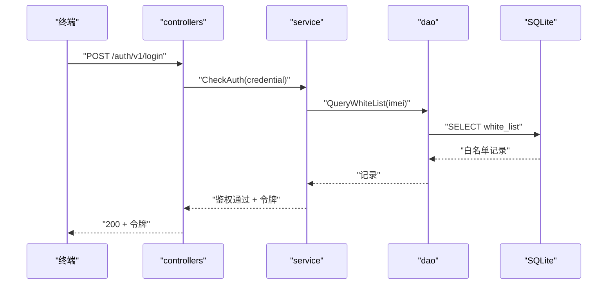

# {流程中文名} 交互模型

> 生成时间：{YYYY-MM-DD}
> 流程入口：{入口类型 + 位置，如 `POST /auth/v1/login` → controllers.AuthController.Login}

## 概述

{1~3 句：业务目标、触发者、参与模块}。例：终端发起登录请求，经 controllers 入口到 service 完成凭证校验，通过后建立会话并下发令牌。

## 主链路时序图

{图示为格式示例：participant 取模块与外部参与方，消息为跨边界调用；主链路只画 happy path，不画 alt/opt/loop}

## 参与方说明

| 参与方 | 类型 | 代码位置 | 本流程中的职责 |
| --- | --- | --- | --- |
| {终端} | 外部触发者 | -（仓外） | {发起登录请求} |
| {controllers} | 模块 | {src/controllers/auth_controller.go} | {接收登录请求，参数校验，回写响应} |
| {service} | 模块 | {src/service/auth_service.go} | {编排鉴权主链路，签发令牌} |
| {dao} | 模块 | {src/dao/white_list.go} | {白名单数据读写} |
| {下游服务/MQ} | 下游服务 | {调用点文件路径；无则整行不写} | {被调场景} |

{类型取值：模块 / 外部触发者 / 下游服务 / 中间件；代码位置为文件路径，不带行号；仓外参与方写"-（仓外）"}

## 补充说明

{2~4 句：点明关键步骤的业务含义与涉及的关键实体状态变更；有缓存短路等运行时方差时一句话交代；下钻到关键类粒度时注明下钻理由；用户线索与实读链路不符时一句话切割}

分支与异常逻辑：归业务规则资产承载（docs/0-biz/rules/{，已建则给具体文件链接；未建写"待补"}）。
