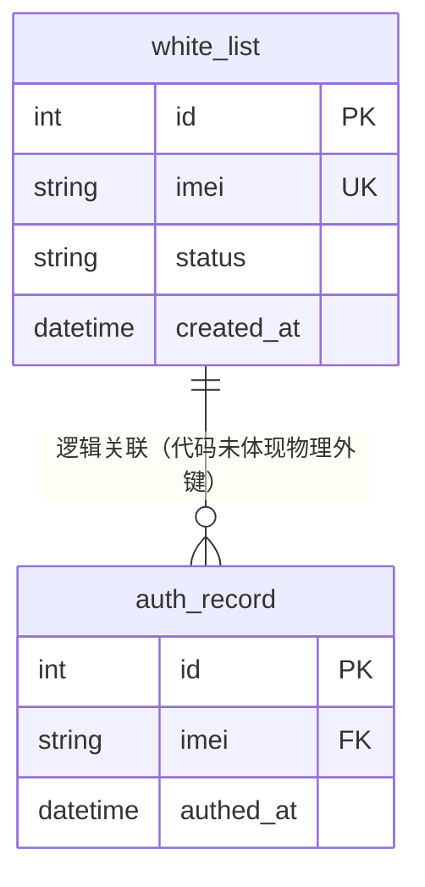

# {实体中文名} 数据模型

> 生成时间：{YYYY-MM-DD}
> 实体定义：{表名 / ORM entity 结构体名 / 缓存结构体名 + 定义位置，如 `white_list` 表 → src/dao/db_local_sqlite.go（CREATE TABLE）+ src/models/db/white_list.go（entity）}

## 概述

{1~3 句：实体的业务含义、持久化形态（表/缓存）、归属模块}。例：white_list 记录允许接入的终端白名单，持久化于 SQLite 表 white_list，由 dao 模块负责读写，service 模块在鉴权时查询。

## ER 图

{图示为格式示例：画出本实体及一跳内直接关联实体；字段列主键 PK / 外键 FK / 唯一键 UK 与关键字段，非关键字段可省略；无 DB 外键约束的逻辑关联照常画出，label 标注"逻辑关联（代码未体现物理外键）"；纯缓存实体无关联时整节可省略并注明}

## 字段表

| 字段 | 类型 | 含义 | 约束 |
| --- | --- | --- | --- |
| {id} | {int} | {主键，自增} | {PRIMARY KEY AUTOINCREMENT} |
| {imei} | {string / VARCHAR(32)} | {终端 IMEI 号} | {NOT NULL UNIQUE；entity tag 与 SQL 列一致} |
| {status} | {string} | {未识别（代码未注释含义）} | {DEFAULT 'active'} |

{字段逐行列出，权威来源为代码 entity 定义与 CREATE TABLE 语句；二者不一致时在约束列并列标注差异；含义从命名/注释/读写代码推断，推断不出写"未识别（代码未注释含义）"}

## 数据生命周期

### 创建

{什么动作触发创建、经过哪些代码（文件路径，不带行号）、初始字段如何取值}。例：管理面新增白名单接口触发，controllers/auth_controller.go 接收参数 → service/auth_manage_service.go 校验 → dao/white_list.go 执行 INSERT，created_at 取当前时间。

### 更新

{什么动作触发更新、经过哪些代码、哪些字段被修改}。例：……

### 归档/删除

{什么动作触发删除或归档、经过哪些代码；软删说明标记字段；无删除路径时如实写"代码未体现删除路径"}。例：……

## 缓存数据结构

| 结构名 | 用途 | TTL | 容量 | 清理策略 | 代码位置 |
| --- | --- | --- | --- | --- | --- |
| {AuthCache} | {缓存鉴权通过的白名单记录，避免每次查库} | {10min} | {LRU 1024 条} | {过期被动淘汰 + 白名单变更时主动失效} | {src/service/auth_cache.go} |

{本实体相关、不落库的运行时结构逐行列出；TTL/容量/清理策略以代码为准，读不到写"未识别"；无缓存结构则整节写"无"；纯缓存实体（无落库表）的文档以本表为主体，字段表改列结构体字段}

## 补充说明

{2~4 句：点明关键约束的业务含义、逻辑关联无物理外键的一致性风险、代码与 SQL 不一致处；关联实体已产出文档时给相对链接，如 [auth_record 数据模型](data-model-auth-record.md)；读不出来、属于业务规约的内容标注"代码未体现，待确认"}
