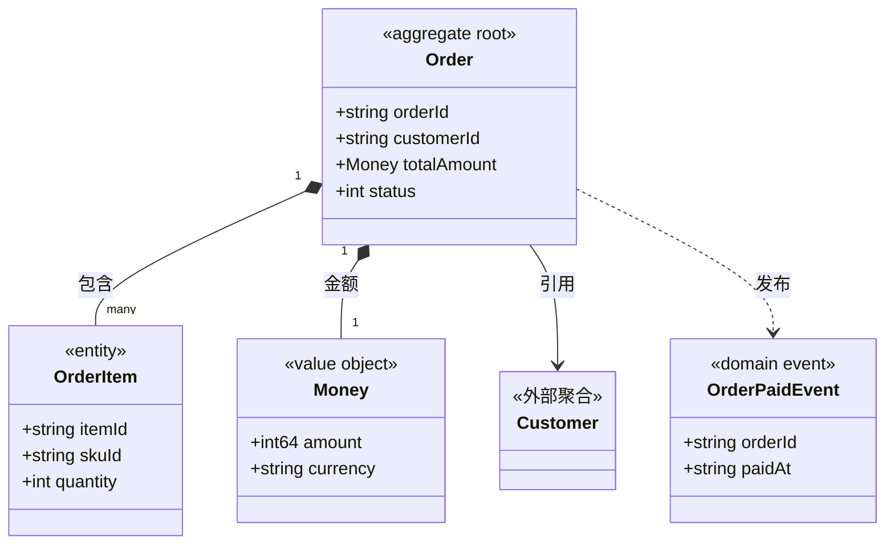

# {聚合中文名} 对象模型

> 生成时间：{YYYY-MM-DD}
> 聚合根：{聚合根代码标识符}（{代码位置，文件路径不带行号}）

## 概述

{1~3 句：聚合的业务职责、一致性边界（哪些对象必须随聚合根一起保证一致）、对象构成；模型层定位依据在此交代}

## 类图

{图示为格式示例：只画聚合内对象的关键属性与关联（方法省略），跨聚合只画引用方向（外部聚合为空壳节点）；类名/属性名取代码标识符原文；泛型集合写作 List~OrderItem~；对象类型用 stereotype 标注}

## 对象说明

| 对象 | 类型 | 代码位置 | 职责 |
| --- | --- | --- | --- |
| {Order} | 聚合根 | {src/models/order.go} | {订单一致性边界，承载订单状态流转} |
| {OrderItem} | 实体 | {src/models/order_item.go} | {订单行项目，记录 SKU 与数量} |
| {Money} | 值对象 | {src/models/money.go} | {金额与币种的不可变封装} |
| {OrderService} | 领域服务 | {src/service/order_service.go} | {编排订单与库存聚合的下单逻辑} |
| {OrderPaidEvent} | 领域事件 | {src/events/order_events.go} | {订单支付完成事实，经事件总线发布} |

{类型取值：聚合根 / 实体 / 值对象 / 领域服务 / 领域事件；代码位置为文件路径，不带行号；跨聚合共享的值对象在首次出现的聚合文档中展开，其余聚合文档本行引用该文档链接；判定存疑的对象职责列注明"待确认"}

## 补充说明

{2~4 句：聚合不变量与一致性边界说明（如"OrderItem 只能随 Order 整体读写"）；跨聚合引用方式（持标识还是持对象）；领域服务的编排范围}

与持久态表结构的对应：归数据模型资产承载（docs/0-biz/data-model/{，已建则给具体文件链接；未建写"待补"}）。
