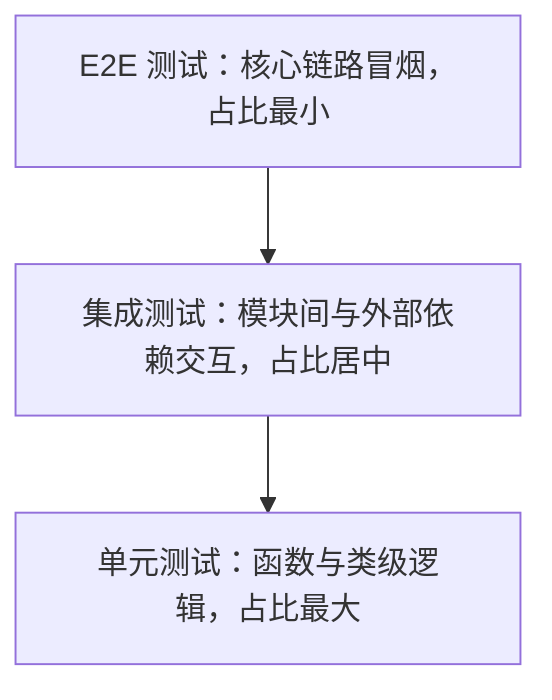

# DT 规范（开发者测试规范）

| 元信息 | 值 |
|--------|-----|
| 分支 | <分支名> 分支 (<YYYY-MM-DD>) |
| 更新日期 | <YYYY-MM-DD> |
| Skill | qual-dt-guidelines-analyze |
| 运行模式 | 起草模式 |
| 文档状态 | 起草待评审 |

## 一、测试现状盘点

### 1.1 测试文件分布

| 测试层级 | 测试文件数 | 分布目录 | 命名模式 | 代表性文件（证据，不带行号） |
|---|---|---|---|---|
| 单元测试 | <N> | <目录路径> | <如 *_test.go> | <文件路径> |
| 集成测试 | <N> | <目录路径> | <命名模式> | <文件路径> |
| E2E 测试 | <N> | <目录路径> | <命名模式> | <文件路径> |
| 层级待确认 | <N> | <目录路径> | <命名模式> | <文件路径> |

<!-- 某层无测试时该行文件数写 0 并注明「未识别」；代表性文件每行列 3~5 个。 -->

### 1.2 测试框架与工具

| 类别 | 选型 | 证据（文件路径） |
|---|---|---|
| 测试框架 | <go testing / JUnit / pytest / Jest / Google Test / 未识别> | <依赖清单文件路径> |
| Mock 工具 | <gomock / Mockito / unittest.mock / 无> | <文件路径> |
| 断言库 | <testify / AssertJ / chai / 无> | <文件路径> |
| 覆盖率工具 | <go cover / JaCoCo / coverage.py / nyc / 未识别> | <文件路径> |

### 1.3 当前覆盖率

- 获取方式：<实测命令，如 `go test -cover ./...`；或既有报告文件路径>
- 数据日期：<YYYY-MM-DD（实测为执行日期，报告文件为其生成日期）>
- 实测结果：行覆盖率 <N>%（分支覆盖率 <N>%；工具不支持分支统计写「未测量」）
- 备注：<未能实测时写「未能实测（原因：xxx）」；分模块覆盖率差异显著时在此概述>

### 1.4 CI 测试关卡

| CI 配置文件 | 测试阶段 | 是否阻断合并 | 已有覆盖率门槛 | 证据（文件路径） |
|---|---|---|---|---|
| <如 .github/workflows/ci.yml> | <阶段/job 名> | <是 / 否> | <有（取值与工具）/ 无> | <文件路径> |

<!-- 无 CI 配置时该节写「未识别 CI 配置（原因：xxx）」，不删除标题。 -->

## 二、测试金字塔与覆盖基线

> 本章为约定性内容，从第一章现状归纳起草，**起草待评审**。

现状形态：<一句话描述现状三层分布形态，如「单测 X 个 / 集成 Y 个 / E2E Z 个，呈正金字塔 / 倒挂 / 哑铃型」；倒挂或畸形时如实指出纠偏方向。>

| 层级 | 定位 | 覆盖范围要求 | 占比基线 |
|---|---|---|---|
| 单元测试 | <进程内单函数/单类> | <新增代码必须具备的测试层级> | ≥ <N>% |
| 集成测试 | <跨模块/外部依赖交互> | <哪些交互必须具备> | <N>%~<N>% |
| E2E 测试 | <全系统核心链路> | <核心业务流程冒烟> | ≤ <N>% |

<!-- 占比基线从现状实测分布归纳给出；与现状差距大时标注「目标值，分阶段达成」。 -->

## 三、用例设计方法要求

> 本章为约定性内容，**起草待评审**。

### 3.1 等价类划分（必选）

<一句话要求：每个公开接口/函数的入参至少划分有效等价类与无效等价类各 1 条用例；结合现状测试用例说明适用点，附代表性测试文件路径。>

### 3.2 边界值分析（必选）

<一句话要求：数值/长度/时间类入参必须覆盖边界点（最小值、最大值、临界 ±1、空值）；结合现状说明适用点，附代表性测试文件路径。>

### 3.3 用例命名与组织

<与仓内既有测试命名模式对齐（从 1.1 现状归纳，不另造）：测试文件放哪、怎么命名、一个被测单元对应几个测试用例的组织方式。>

## 四、自测报告要求

> 本章为约定性内容，**起草待评审**。

- 触发时机：<新功能 / bugfix 的 MR 必须附自测报告>
- 必含内容：测试范围（改了什么）、用例清单（测了什么，含等价类/边界值覆盖说明）、覆盖率结论（新增代码覆盖率实测值）、遗留风险
- 呈现形式：<MR 描述内附 / 独立文档，按团队习惯定，起草时给默认建议>

## 五、新增代码覆盖率门禁（红线）

> 本章为红线约定；门禁线取值为**建议值，待团队确认**，确认前门禁不生效。

- 门禁线：新增代码行覆盖率 ≥ **<N>%（建议值，待团队确认）**
  - 建议依据：当前整体覆盖率实测 <N>%（见 1.3），门禁线按<不低于现状 / 现状向上取整到 5 的倍数>给出。
- 测量口径：
  - 基准分支：<如 main / master>，新增代码 = MR diff 命中的行
  - 统计方式：diff coverage（新增行的行覆盖率），工具：<如 diff-cover / go tool cover + diff 过滤>
  - 排除项：生成代码、vendor/、第三方目录、<仓内既有排除约定>
- 拦截语义：MR 新增代码覆盖率低于门禁线时 CI 判定 **BLOCK**，禁止合入。
- 豁免路径：<紧急修复等豁免情形与审批方式，起草时给默认建议；无豁免写「暂无豁免」>

## 附注（可选）

<以下情形逐条列出，附证据文件路径；各类无内容时写「无」而非删除条目>

- 空转测试：<测试代码存在但被测代码已删除/无任何断言的文件>
- 零测试模块：<业务代码存在但无任何对应测试的模块目录>
- 多套框架并存：<同一层级并存多套测试框架/Mock 工具的情况与统一建议>
