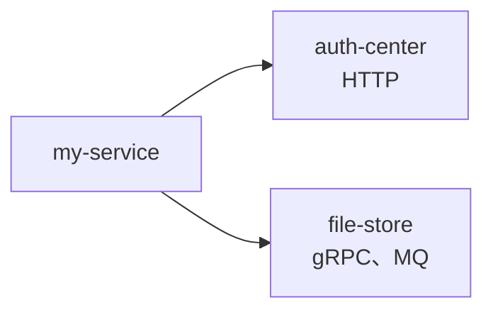

# {仓名} 文档资产总索引

> 生成时间：{YYYY-MM-DD}
> 生成工具：spec-index（自动聚合产物，同名覆盖更新；资产变更后重跑 spec-index 刷新，请勿手改）
> 布局规范：specgo HELP.MD v1.1——每类资产一个单独目录（docs/0-{域}/{资产}/）

## 四域导航

| 域 | 治理问题 | 已建资产 | 域索引 |
| --- | --- | --- | --- |
| 0-arch（架构要素） | 定结构：代码往哪放 | {资产目录名列表，顿号分隔；无资产写「暂无资产」} | [0-arch/README.md](0-arch/README.md)（无资产时填「—」，不留死链） |
| 0-biz（业务要素） | 定业务：对象怎么建、数据存什么 | {同上} | {同上} |
| 0-tech（技术要素） | 定用法：机制怎么用、调用怎么跑 | {同上} | {同上} |
| 0-qual（工程要素） | 定规矩：写到什么程度才算合格 | {同上} | {同上} |

## 服务依赖全景图

<!-- 数据源：docs/0-tech/external-call-guidelines/external-call-guidelines-{service}.md，每篇 = 一个下游服务节点。
     节点 id 仅字母数字下划线（slug 中 `-` 转 `_`），label 一律加双引号，边 label 标协议。
     docs/0-tech/external-call-guidelines/ 缺失或无服务文档时：删除下方 mermaid 块与依赖详情行，本节只保留一行——
     通信规范资产未建（docs/0-tech/external-call-guidelines/ 缺失），请先运行 tech-external-call-guidelines-analyze 提取出站调用后再生成全景图。 -->

依赖详情见各服务通信规范文档：[docs/0-tech/external-call-guidelines/](tech/external-call-guidelines/)。

## 附注（可选，无此类情况整节删除）

- {taxonomy 外目录提示：如「docs/business/ 不在 specgo v1.1 taxonomy 内，未索引；如需治理请运行 spec-init 迁移」}
