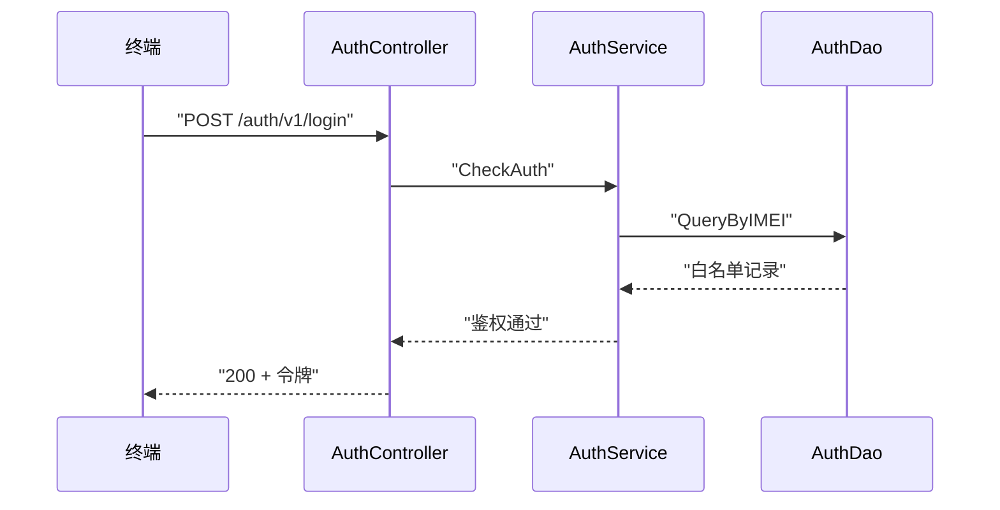

# <流程名> 业务流程

> 最近更新：<梳理触发来源>，YYYY-MM-DD

## 1. 流程概述

<1~3 句：业务目标、触发者、参与角色>。例：终端发起登录请求，GIDS 鉴权服务校验凭证合法性，通过后建立会话并下发令牌。

## 2. 主流程

<主流程图的补充说明：2~4 句，点明关键步骤的业务含义与关键分支去向，如"鉴权未命中白名单时返回 -2 拒绝，不建立会话；DB 异常走逃生策略按内存缓存判定"。>
