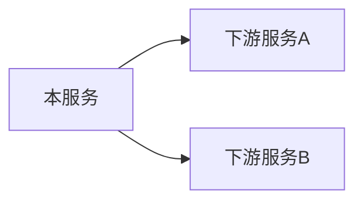

# Spec 外部调用分析（出站接口盘点）

核心思想：与 spec-interface-analyze（入站方向：本服务对外暴露什么接口）互补，本 skill 盘点出站方向——本服务**调用了哪些外部服务的哪些接口**，按目标服务归类成文档。

## 工作流程（三阶段，严格按序执行）

### 阶段 1：全仓扫描，识别出站调用点

按以下模式全仓搜索（兼顾多语言，按仓内实际技术栈取舍）：

- **HTTP 客户端**：RestTemplate / WebClient / @FeignClient、okhttp、HttpClient、requests / httpx、axios / fetch、Go net/http、封装的公司内部 HTTP SDK
- **RPC / IDL client**：gRPC stub（NewXxxClient）、Dubbo @Reference、Thrift client、Kitex/Hertz、自研 RPC 框架 client  stub
- **消息队列生产端**：Kafka producer、RocketMQ producer、RabbitMQ publish、Pulsar producer
- **进程间通信**：Unix domain socket、命名管道、共享内存、本地 RPC/signal 调用
- **平台/公司内部 SDK 出站**：告警 SDK、监控/话统 SDK、证书 SDK、日志 SDK、注册发现 client 等——封装在 stubs/vendor 内但**调用点在业务代码**的也算出站调用，记录业务调用位置
- **外部存储**：外部 DB 连接（MySQL/PostgreSQL 等，含连接串获取方式）、Redis/OSS 等中间件 client 调用
- **配置辅助定位**：yaml / properties / 配置中心中的下游服务地址（host:port、服务发现名）、代理/网关封装层；微服务框架的 `references`/依赖声明清单

每个调用点记录：协议类型、接口标识（URL path / RPC 方法 / topic）、调用位置（所在文件，**不带行号**）、所在函数与业务模块。

### 阶段 2：判定目标服务归属

按优先级推断每个调用点属于哪个外部服务：

1. **显式服务名**：服务发现名、Feign name、gRPC target、配置 key 中的服务名
2. **配置映射**：host/域名/IP+端口 在配置文件中的服务命名
3. **上下文推断**：包名/类名/常量命名（如 XxxServiceClient）、注释
4. **无法判定的归入「未知服务」分组**，标注待人工确认——**不臆造服务名**

### 阶段 3：生成文档

输出到代码仓 `docs/external-call/` 目录：1 个主文档 `README.md` + 每个外部服务一个子文档 `external-call-<服务名>.md`（服务名英文 kebab-case）。

主文档 README.md 骨架：

````markdown
# 外部接口调用

| 元信息 | 值 |
|--------|-----|
| 代码仓 | <仓库名> |
| 分析基准 | <分支名> 分支 (<YYYY-MM-DD>) |
| 更新时间 | <YYYY-MM-DD> |
| Skill | spec-external-call-analyze |
| 主要语言 | <语言> |
| 出站协议 | <命中的协议类型，如 HTTP / gRPC / Kafka> |

## 外部服务全景



| 服务名 | 协议 | 接口数 | 主要业务域 | 归属判定依据 |
|---|---|---|---|---|
| <服务名> | <协议> | <N> | <业务域> | <显式服务名 / 配置映射 / 上下文推断> |

## 附注

- 死代码（客户端封装存在但无任何业务调用方）：<逐条列出，无则写"无">
- 配置声明但代码中无实际调用的下游：<逐条列出，无则写"无">
````

子文档 external-call-<服务名>.md 骨架（按协议分二级小节，每个外部调用接口一个三级章节）：

````markdown
# <服务名>

## 接口清单（可选，章节较多时在文档开头加）

| 接口名 | 协议 | 调用位置 | 业务场景 |
|---|---|---|---|
| <接口名> | <协议> | <文件（函数）> | <一句话> |

## HTTP

### <接口名：方法+路径>

- 协议：HTTP POST /auth/v1/authIMEI
- 调用位置：service/instance_service.go（GetInstanceAuth 函数）
- 业务场景：<什么业务流程中发起该调用，从调用点所在函数/模块/注释推断；推断不出标「待确认」>
- 接口功能：<该调用完成什么功能，请求什么、返回什么>

## <RPC / MQ / IPC>

### <RPC 方法 / topic / IPC 方式名>

- 协议：<gRPC 方法 / MQ topic / IPC 方式>
- 调用位置：<文件（函数）>
- 业务场景：<同上>
- 接口功能：<同上>
````

规则：
- **业务场景不得臆造**：从调用点上下文推断；推断不出标「待确认」
- 同一接口多处调用：合并为一个章节，调用位置列出全部文件
- **预留死代码单列**：客户端封装存在但无任何业务调用方的（如未被引用的 Redis/OSS client），不计入接口清单，仅在 README 附注说明
- **配置声明 vs 实际调用差异**：微服务框架依赖声明（如 references）中声明了但代码中无实际调用的下游，在 README 附注列出，避免误导依赖治理

### 阶段 4：验证 mermaid 图可渲染（收尾必做）

产出文档中含 ```mermaid 代码块（下游依赖全景图等），交付前必须运行 spec-mermaid-diagram skill 的本地验证脚本逐文件校验：

```bash
node <specgo插件目录>/skills/spec-mermaid-diagram/scripts/validate-mermaid.mjs <产出文件...>
```

- 全部 VALID 才算完成；INVALID 按报错行号定位修复后重验，禁止跳过。
- 首次使用需先在脚本目录执行 `npm install`（安装 mermaid + linkedom，node_modules 不入库）。
- 画图规则（label 一律加引号、时序图消息禁 `;`、裸 `end` 禁用等）见 spec-mermaid-diagram skill 的「语法红线」。

## 输出规范

- 归档目录：代码仓 `docs/external-call/`（README.md + external-call-<服务名>.md 若干）
- 全程中文输出
- 与 spec-interface-analyze 产出互补：入站看 docs/interface/，出站看 docs/external-call/
