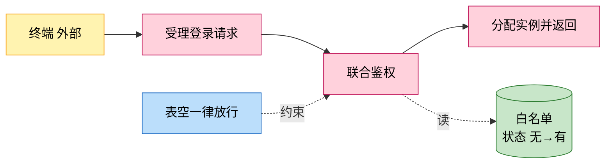
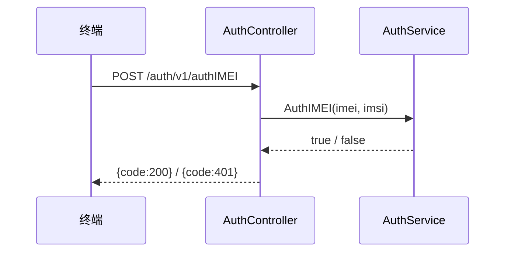
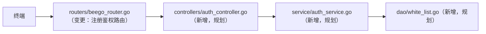

# {功能名} Story

> 需求概述：一两句话说明该需求解决什么业务问题。
> 来源：{需求文档路径}（下称"需求"）　分支：{分支名}（{YYYY-MM-DD}）

## 1. 需求概述（多彩建模）

实现逻辑速览（1~3 句，每句 ≤30 字，业务语言，禁文件名/函数名/行号）：

{收到请求后先联合鉴权，命中白名单才分配实例，未命中直接拒绝。}

术语表：

| 术语 | 人话解释 | 出处 |
| --- | --- | --- |
| {就绪实例} | {插件装完、容量有余、健康在线的实例} | {src/service/browser_service.go} |

## 2. 核心要素变更总览

八类核心要素逐行判定，变更类型取值：**新增**（本需求引入）/ **变更**（对既有要素的修改，摘要必须写清"对哪个要素做了什么更改"）/ **不涉及**。整篇文档第 3~10 节与该表一一对应，"不涉及"的要素省略对应节。

| 核心要素 | 变更类型 | 变更摘要 |
| --- | --- | --- |
| 对外接口 | {新增} | {POST /auth/v1/authIMEI 终端联合鉴权} |
| 业务规则 | {变更} | {登录链路在实例路由前注入白名单联合鉴权规则} |
| 数据模型 | {新增} | {t_white_list 表（IMEI+IMSI 组合记录）} |
| 对象模型 | 不涉及 | - |
| 领域词典 | {新增} | {术语「联合鉴权」「逃生态」} |
| 交互流程 | {变更} | {网格登录主链路在路由判定前插入鉴权环节} |
| 外部服务调用 | 不涉及 | - |
| 技术要素 | {新增} | {鉴权结果进程内缓存（RWMutex + TTL 30min）} |

## 3. 对外接口

### 新增

| 接口 | 路径/入口（含注册处） | 请求结构 | 响应结构 | 状态 |
| --- | --- | --- | --- | --- |
| {AuthIMEI} | {POST /auth/v1/authIMEI；入口 controllers/auth_controller.go（规划）；注册 routers/beego_router.go（规划）} | {AuthIMEIRequest：{imei, imsi} 均必填} | {BaseResponse：code=200 通过 / 401 拒绝} | 设计中 |

### 变更

| 既有接口 | 更改内容（变更前 → 变更后） | 更改位置 | 对调用方影响 |
| --- | --- | --- | --- |
| {GridLoginAuth} | {无鉴权直接路由实例 → 路由前注入白名单联合鉴权，未命中返回 401} | {controllers/login_controller.go} | {出入参契约不变，新增 401 失败语义} |

<!-- 无"新增"或无"变更"时省略对应小节；整要素"不涉及"时整节省略（第 2 节总览表已标注） -->

## 4. 业务规则

### 新增

| 规则 | 条件 → 动作 | 依据（需求章节/规划代码位置） |
| --- | --- | --- |
| {联合鉴权} | {IMEI+IMSI 同时精确命中白名单 → 放通；任一未命中 → 拒绝} | {需求 §2.2.3} |

### 变更

| 既有规则 | 变更前 → 变更后 | 位置 |
| --- | --- | --- |
| {设备登录鉴权} | {直接放通 → AppType=TikTok 时增加沐恩二次登录} | {service/remote_service.go} |

## 5. 数据模型

### 新增

| 结构/表 | 关键字段（含义+约束+索引） | 生命周期 |
| --- | --- | --- |
| {t_white_list} | {imei char(15) 设备标识；imsi char(15) 用户身份标识；联合匹配无唯一约束} | {导入写入，覆盖更新整表替换} |

### 变更

| 既有表/结构 | 更改内容（变更前 → 变更后） | 位置 |
| --- | --- | --- |
| {t_session_stats} | {无 tcp_unique_id → 增补 tcp_unique_id varchar(36) + UNIQUE 索引} | {dao/db_init.go} |

## 6. 对象模型

### 新增

| 对象 | 关键属性与关联 | 说明 |
| --- | --- | --- |

### 变更

| 既有对象 | 更改内容（字段/关联，变更前 → 变更后） | 位置 |
| --- | --- | --- |

## 7. 领域词典

| 术语 | 释义 | 变更类型（新增/释义演进） | 落入子域 | 代码命名映射（规划） |
| --- | --- | --- | --- | --- |
| {逃生态} | {白名单表为空时鉴权一律放行} | 新增 | {终端鉴权白名单} | {authFromDB Count==0 分支，service/auth_service.go（规划）} |

## 8. 交互流程

### 新增链路

实现说明（多句话逐步说明，每句 ≤30 字，业务语言、可落到编码）：

- {解析请求取 IMEI/IMSI，格式非法直接拒绝。}

### 变更链路

| 链路 | 变更点（在哪个环节插入/替换/删除什么） |
| --- | --- |
| {网格登录} | {在"解析请求"与"实例路由"之间插入白名单联合鉴权环节，未命中中断返回} |

（变更链路须另画变更后主链路时序图，体现插入/替换后的环节顺序）

## 9. 外部服务调用

### 新增

| 调用 | 服务与端点 | 契约（请求/响应/超时） |
| --- | --- | --- |

### 变更

| 既有调用 | 更改内容 | 位置 |
| --- | --- | --- |

## 10. 技术要素

| 技术要素（并发/数据访问/韧性/日志配置告警） | 变更类型 | 内容 | 位置 |
| --- | --- | --- | --- |
| {鉴权缓存} | 新增 | {进程内 RWMutex 缓存，TTL 30 分钟，超 1000 条惰性清理 500 条} | {service/auth_cache.go（规划）} |

## 11. 实现方案与修改清单

| 模块 | 变更类型 | 承载功能与更改内容 |
| --- | --- | --- |
| {controllers/auth_controller.go} | 新增（规划） | {鉴权接口入口、参数校验、响应封装} |
| {service/browser_service.go} | 变更 | {路由判定前增加鉴权调用，未命中返回错误} |
| {models/resp/response_entity.go} | 复用 | {统一响应信封 BaseResponse} |

## 12. 外部文档引用

本设计参考的仓内资产，逐类一行；链接必须指向仓内真实存在的文件，无死链；某类确无引用须注明"无引用"及原因，禁止整节省略：

| 文档类型 | 引用文档 | 引用点 |
| --- | --- | --- |
| 接口文档 | {[interface-login.md](../biz/interface/interface-login.md)} | {既有登录链路注入点对照} |
| 外部接口文档 | {[comm-guidelines-muen.md](../tech/comm-guidelines/comm-guidelines-muen.md)} | {沐恩二次登录调用契约} |
| 基础框架文档 | {[usage-beego.md](../tech/usage/usage-beego.md)} | {Beego 路由注册与 ORM 约定（逐个框架一行，只列真实需要的）} |
| 结构模型文档 | {[structure-model.md](../arch/structure-model/structure-model.md)} | {新模块 controllers/service/dao 分层归属依据} |
| 既有 story | {[login-story.md](login-story.md)} | {被注入链路的原始设计} |
| 其它资产（rules/lexicon/data-model 等，按需） | {…} | {…} |
