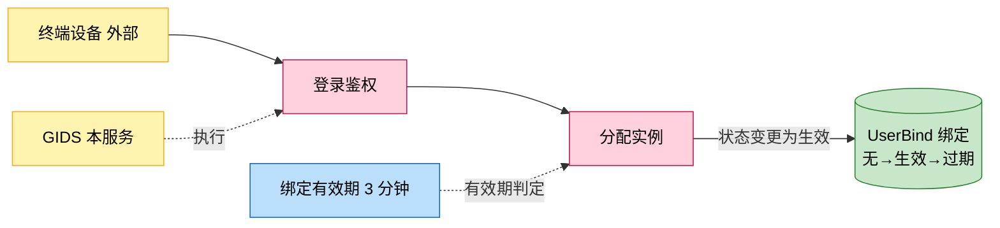
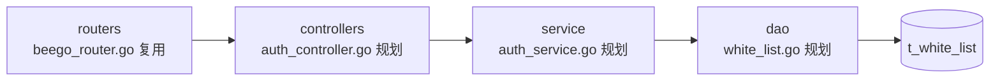
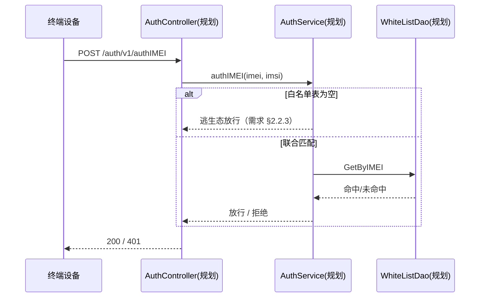

# <功能名>

> 功能域概述：一两句话说明该功能解决什么业务问题。
> 接口数：N 个新增（设计中）+ M 个注入点　核心模块：a, b, c
> 来源：<需求文档路径>（下称"需求"）

## 1. 功能故事（多彩建模）

实现逻辑速览（1~3 句，每句 ≤30 字，业务语言，禁文件名/函数名/行号）：

登录先建档，再按绑定有效性复用或重分实例。

术语表：

| 术语 | 人话解释 | 出处 |
|---|---|---|
| 逃生态 | 白名单表为空时一律放行，避免未配置导致全量阻断 | 需求 §2.2.3 |

## 2. 模块划分

| 模块 | 承载功能 |
|---|---|
| controllers/auth（规划） | 三个 HTTP 入口，不做业务逻辑（需求 §2.4） |
| service/auth（规划） | 鉴权决策（需求 §2.4） |
| dao/white_list（规划） | 白名单表读写（需求 §2.4） |
| controllers login（复用，src/controllers/login_controller.go） | 注入鉴权调用（需求 §3） |

## 3. 接口清单

只列对外接口；新增接口状态"设计中"，既有链路注入点单独标注：

| 接口 | 路径/入口 | 请求结构 | 响应结构 | 状态 |
|---|---|---|---|---|
| 终端联合鉴权 | POST /auth/v1/authIMEI（规划 auth_controller） | JSON{imei, imsi} | 均命中 200 / 未命中 401 | 设计中 |
| gridLoginAuth（注入） | POST /app-api/.../gridLoginAuth（src/controllers/exlogin_controller.go） | LoginAuthRequest | 鉴权失败 code=-2 | 在用，27.0 起注入鉴权 |

## 4. 关键数据结构

| 结构 | 定义位置 | 关键字段 |
|---|---|---|
| t_white_list 表 | 规划 models/db/white_list.go | IMEI char(15) 建索引；IMSI char(15) 建索引；联合索引（需求 §7） |
| cacheEntry | 规划 service/auth_cache.go | result + expireAt；容量 1000/TTL 30min（需求 §2.2.4） |

## 5. 调用关系

每条主链路一张 mermaid 时序图，需求中的分支用 alt/opt 表达：

关键分支与异步环节（各一句，带依据）：

- 导入为同步事务，整批失败回滚（需求 §4）
- 缓存无独立 goroutine，清理在写锁内完成（需求 §2.2.4）

## 6. AI 编码指南

只列实现要点，每条 ≤30 字，附依据（需求章节号或存量文件）：

- 新接口注册进内部监听 RouteMapping（src/routers/beego_router.go）
- 表结构必须双 DDL 同步（src/dao/db_init.go）

## 7. 外部文档引用

本设计参考的仓内规格化资产，六类逐行列出；关键类必须引用，基础框架文档逐个框架一行，其余类确无引用须注明"无引用"及原因：

| 文档类型 | 引用文档 | 引用点 |
|---|---|---|
| 关键类（必须） | [docs/key-class/README.md](../key-class/README.md) | 复用 BrowserService 实例分配；在 LoginController 登录链路注入鉴权调用 |
| 接口文档 | [spec-interface-login.md](../interface/spec-interface-login.md) | gridLoginAuth 既有链路注入点确认 |
| 外部接口文档 | [external-call-muen-cloud.md](../external-call/external-call-muen-cloud.md) | TikTok 场景 muen 云登录转发契约 |
| 基础框架文档 | [rpc-beego-web.md](../framework-usage/rpc-beego-web.md) | Beego Web：新 Controller 按 RouteMapping 注册到内部监听（src/routers/beego_router.go） |
| 基础框架文档 | [storage-beego-orm.md](../framework-usage/storage-beego-orm.md) | beego ORM：白名单表按三步曲实现，双 DDL 保持一致（src/dao/base_dao.go） |
| struct 结构文档 | [spec-structure.md](../structure/spec-structure.md) | 新模块分层归属（controllers/service/dao）依据 |
| 数据结构文档 | [spec-data-structure-map.md](../data-structure/spec-data-structure-map.md) | 白名单集合（map 当 set）实例对照（src/models/whitelist.go） |
