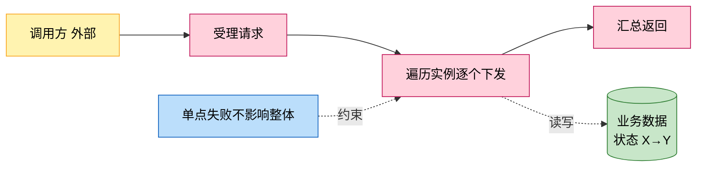
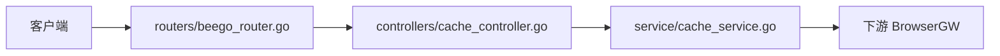
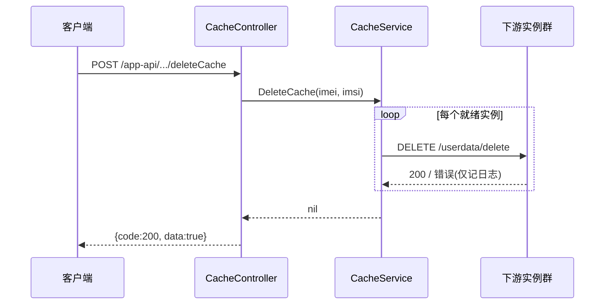

# <功能名>

> 功能域概述：一两句话说明该功能解决什么业务问题。
> 接口数：N 个新增（设计中）+ M 个注入点　核心模块：a, b, c
> 来源：<需求文档路径>（下称"需求"）

## 1. 功能故事（多彩建模）

实现逻辑速览（1~3 句，每句 ≤30 字，业务语言，禁文件名/函数名/行号）：

收到请求后筛出全部健康实例，逐台下发指令，单台失败只记日志。

术语表：

| 术语 | 人话解释 | 出处 |
|---|---|---|
| 就绪实例 | 插件装完、容量有余、健康在线的实例 | src/service/browser_service.go |

## 2. 实现方案

| 模块 | 承载功能（引用文件） |
|---|---|
| controllers/cache_controller.go | 路由表声明与入口、失败审计日志、响应封装（src/controllers/cache_controller.go） |
| service/cache_service.go | 业务编排与下游调用（src/service/cache_service.go） |

## 3. 接口清单

只列对外接口与本功能的出向调用，五列表格，不写散文：

| 接口 | 路径/入口（含注册处） | 请求结构 | 响应结构 | 状态 |
|---|---|---|---|---|
| DeleteCache | POST /app-api/.../deleteCache；入口 src/controllers/cache_controller.go；注册 src/routers/beego_router.go | DeleteCacheRequest（src/models/req/request_entity.go）：{imei, imsi} 均必填 | DataResponse（src/models/resp/response_entity.go）：{code, message, data} | 在用 |
| （出向）BrowserGW 删除用户数据 | DELETE http://{endpoint}/browsergw/browser/userdata/delete（src/service/cache_service.go） | JSON {imei, imsi}；超时 5s | 仅接受 HTTP 200 | 在用 |

## 4. 关键数据结构

| 结构 | 定义位置 | 关键字段（含义+约束） |
|---|---|---|
| DeleteCacheRequest | src/models/req/request_entity.go | IMEI（json imei，必填，Validate 非空校验）；IMSI（同约束） |

## 5. 调用关系

每条主链路一张 mermaid 时序图：

关键分支与异步环节（各一句，带证据文件）：

- 解析/校验失败返回 code=-2（src/controllers/controller.go）
- 单实例失败不中断、不上抛，整体仍报成功（src/service/cache_service.go）

## 6. 外部文档引用

本功能关联的仓内规格化资产，六类逐行列出；关键类必须引用（类名须有代码事实依据），基础框架文档逐个框架一行，其余类确无引用须注明"无引用"及原因：

| 文档类型 | 引用文档 | 引用点 |
|---|---|---|
| 关键类（必须） | [docs/business/key-class/README.md](../key-class/README.md) | 本功能链路涉及关键类 BrowserService（取就绪实例，src/service/cache_service.go）、https.Builder（下游调用构造） |
| 接口文档 | [spec-interface-cache.md](../interface/spec-interface-cache.md) | deleteCache 对外接口契约对照 |
| 外部接口文档 | [external-call-browser-gateway.md](../../technical/external-call/external-call-browser-gateway.md) | （出向）userdata/delete 调用契约，与第 3 节出向行对应 |
| 基础框架文档 | [rpc-beego-web.md](../../technical/framework-usage/rpc-beego-web.md) | Beego Web：路由注册与请求处理（src/routers/beego_router.go、src/controllers/cache_controller.go） |
| struct 结构文档 | [structure-model.md](../../../doc/arch/structure-model.md) | 本功能模块在 controllers/service/common 分层中的位置 |
| 数据结构文档 | [spec-data-structure-map.md](../data-structure/spec-data-structure-map.md) | 本功能依赖的会话缓存实例（src/models/session.go） |
