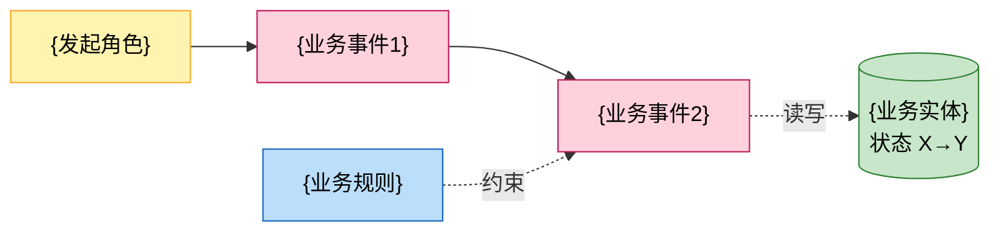

# 功能设计

## 1 功能编号：XXX 功能实现（新增）

### 1.1 功能概述

本章节对实现该功能的背景和目的进行概述。

### 1.2 多彩建模

本章节用多彩建模法梳理本功能的业务逻辑全貌，作为后续实现设计的业务骨架。四色元素判定口诀：事件要记账（粉）、参与有身份（黄）、对象客观在（绿）、规则复用蓝。

业务故事速览（1~3 句，每句 ≤30 字，业务语言，禁文件名/函数名/行号）：

【此处用业务语言概括功能实现逻辑】

四色建模图（classDef 固定配色：粉 #ffd1dc / 黄 #fff3b0 / 绿 #c8e6c9 / 蓝 #bbdefb；粉色事件按时序连成主干，每个事件具备 触发者（黄）/输入（绿/蓝）/输出（绿）/后继（粉） 四要素；事件名用人话业务动作；绿色实体标注状态变更（X→Y）；蓝色规则用虚线挂到对应实体）：

术语表（覆盖业务故事与后续章节中的全部业务缩写/黑话/外部系统名，每条一句话人话解释并注明出处）：

| 术语 | 人话解释 | 出处 |
| --- | --- | --- |
| | | |

说明：粉色事件是可被编码的业务事件，其 触发者/输入/输出/后继 四要素缺一不可，缺项即为逻辑断裂点，须先回补再进行后续实现设计。

### 1.3 SR设计

在系统需求分析时，需要把SR关联到功能上，并承载在IT系统中。在功能设计时，可以通过IT系统导出本功能相关的SR清单。

| 系统需求编号 | 系统需求 | 系统需求描述 |
| --- | --- | --- |
| | | |

功能设计说明书是跨版本维护的，并且可以基于版本生成对应的数字化文档，本章节默认导出所选择版本的增量SR，但可以选择查看历史版本的SR清单。

本章节可对本版本的SR进行设计，描述SR的实现方式，对已有功能设计的修改，以及如何分解到实现元素。本章节主要为增量的设计内容，如对实现设计中的全量设计内容有修改，应同步刷新对应的内容。

部分SR关联了安全SPEI（安全领域策略使能项）实例，可在本章节对这类SR如何设计实现进行说明：

简单的、相对独立的安全实例化设计可以在本章节进行增量描述。比如：对"使用xxx强度的密码算法"的要求，可在本章节增加"使用公司xx加密组件"的设计描述。然后在安全配置设计、DFX分析章节产生相关的功能规格和AR即可。

与功能实现设计耦合密切的安全实例化设计则需要结合功能实现设计、接口设计、规格设计来开展，可在本章节简述增量设计思路，在实现设计、用户接口设计章节分别进行实现设计的描述并被本章节引用，然后在DFX分析章节产生相关的AR。比如：对于"密钥发送方和接收方进行双向身份认证"的要求，需要在实现设计中相关的用例中增加密钥收发相关的系统元素的交互、需要设计密钥收发认证接口、并根据设计可能需形成功能规格。

安全实例化设计可参考安全参考设计，以及SPEI实例关联的FR、FD、安全技术货架组件等安全设计资产。对于FD也需要进行实例化的设计；对于安全技术货架组件的使用，需要进行必要的集成设计。

本章节参考的安全实例化设计描述如下（样例以表格描述，产品可根据实际情况以子章节描述）：

| 系统需求编号 | 系统需求 | SPEI实例描述 | 实例化设计 |
| --- | --- | --- | --- |
| SRxxxx1 | 采用足够强调的加密算法 | 使用xxx强度的密码算法 | 使用公司xx加密组件 |
| SRxxx2 | 密钥收发进行双向认证 | 密钥发送方和接收方进行双向身份认证 | 调用密钥中心的密钥发放接口获取密钥，并使用HTTPS接口进行双向认证。详细设计参考实现设计相关章节 |

### 1.4 实现设计

本章描述功能的具体实现方式，应当描述对功能输入所执行的所有操作，以及产生的对应输出，对功能规格和约束进行设计。建议根据功能的复杂程度，选择采用自然语言、时序图、状态机（算法）等适合的方式。

对功能处理和交互过程进行描述时，要注意具体交互的确切次序，以及各种事件的时序；描述的时候要以基本流程为主，并根据需要补充描述分支流程和异常处理，必要的时候可以再细分子流程，子流程可被基本流程、分支流程、异常处理流程调用。

采用自然语言进行描述时，可以首先说明这些处理是分别在哪个系统元素进行的，以便于以后整理得到系统元素规格，建议每个系统元素的一个处理过程分为一个小段描写。将来每一小段都是某一个系统元素的一条分配需求，容易进行规格列表的整理。同理如果采用自然语言对时序图等进行辅助描述时，亦可采用同样的处理方式。

在功能设计过程中，也需要将和功能相关的非功能需求，伴随着功能的分析过程分配到各个系统元素中，例如，当某一个功能要求某个系统元素处理某种类型的消息时，那么同时也可以提出相关的性能需求，比如，在同一时间最多处理200个此类型的消息。又比如，某个系统元素需要保存相关的一些信息到硬盘上，那么也可以提出相关的性能需求：一次信息处理和存储完成的时间不超过5秒。等等。

另外，如果要限定系统元素内部的实现方式时，也可以提出一些设计约束，比如建议采用的物理器件，具体的算法要求，限定的实现接口类型等。

功能定义中的输入、处理、输出、规格、约束，需要有对应的设计内容与之对应，以确保设计完整，如何具体表达对应的映射关系不做限制。

时序图、活动图或者其他描述方式对功能实现开展的设计，与系统用例类似，都是通过一系列的交互完成特定的任务。与系统用例不同的是，在功能设计中，需要将系统展开，体现更细粒度的交互过程（如时序图一般展开到架构元素，活动图展开到子活动，等等），本文将这些设计内容称为设计用例，采用独立的章节进行描述，章节名称为xxx用例设计。

功能实现设计中，进行安全实例化设计的说明：

不能简单的进行增量设计描述的安全实例化设计，需要在本章节进行描述。如果上述安全设计和功能实现设计耦合密切，可以合并到功能的用例设计中共同进行。如果安全设计相对独立，可以进行独立的设计，以独立的章节承载。

在这个过程中，针对量化的、能力型的设计结果，可以形成条目化的功能规格，刷新到功能树中。同时，设计需要分解到架构元素（采用序列图等方式），形成AR往下游传递。

在进行设计时，可参考安全参考设计，以及SPEI实例关联的FR、FD、安全技术货架组件等安全设计资产。对于FD需要进行实例化的设计；对于安全技术货架组件的使用，需要进行集成设计。

#### 1.4.1 Xxx用例设计-时序图

用例编号：（给设计用例进行唯一编号）

时序图描述方式（通过时序图等描述时，亦可通过自然语言描述进行辅助）：

【此处插入时序图】

说明：

1）采用时序图方式进行设计说明时，时序图中的生命线建议调用架构设计的逻辑元素或者实现元素，不同架构元素之间的交互，也建议调用架构设计的逻辑接口或者实现接口。如果功能设计涉及的元素、接口在架构设计中不存在，则建议应该先刷新架构设计的内容。

2）生命线上的活动承载的是该逻辑元素已实现、新增或修改的行为。这部分内容，建议作为系统实现元素规格（如果生命线上是逻辑元素，则需要将逻辑元素的规格转换为实现元素的规格）。

#### 1.4.2 Yyy用例设计-时序图（可选）

xxx

#### 1.4.3 Xxx用例设计-活动图（可选）

xxx

#### 1.4.4 Xxx用例设计-状态机（可选）

xxx

#### 1.4.5 Xxx用例设计-自然语言描述（可选）

用例编号：（给设计用例进行唯一编号）

前置条件：XXX

触发事件：XXX

主流程描述X（可以有多个主流程，亦可有备选流程、异常流程，描述方法相同）：

流程描述：

- 步骤1：；
- 步骤2：；
- 步骤3：；
- 步骤4：；

后置条件：Xxx；

### 1.5 用户接口设计

判断是否涉及对外接口变化。如果涉及，对系统对外接口包括OM接口，进行实现方案设计，其中OM接口设计内容包括：

1. 此OM接口作用和应用场景说明
2. 接口使用的前提条件（例如是否有权限要求，是否需要先完成其他配置等）
3. 接口使用的约束和限制（例如xx场景不支持该接口等信息）
4. 基于数字化工具，输出告警、性能指标、OM操作接口和系统参数的数字化对象定义。

### 1.6 实现接口设计

#### 1.6.1 接口设计

对系统元素进行实现接口设计，接口定义到接口名称、接口职责、接口输入输出要求，产品按需要求是否定义到具体参数。

以下是示意描述模板，产品按需修订采用，建议使用工具管理。

| | |
| --- | --- |
| 接口名称 | |
| 接口描述 | |
| 接口类型 | |
| 所属系统元素 | |
| 归属的逻辑接口名 | ITF_XX_CFG |
| Input要求/参数（可选） | 产品自己判断是仅输出接口要求，还是输出具体参数 |
| Output要求/参数（可选） | |
| 规格、约束和注意事项 | |
| 版本变化 | V3R1新增 |
| 接口源码文件（系统级接口可选） | TR3不要求。基于接口管理工具进行接口资产管理的，通过工具来维护或检查一致性，新增接口TR5要完成。 |

