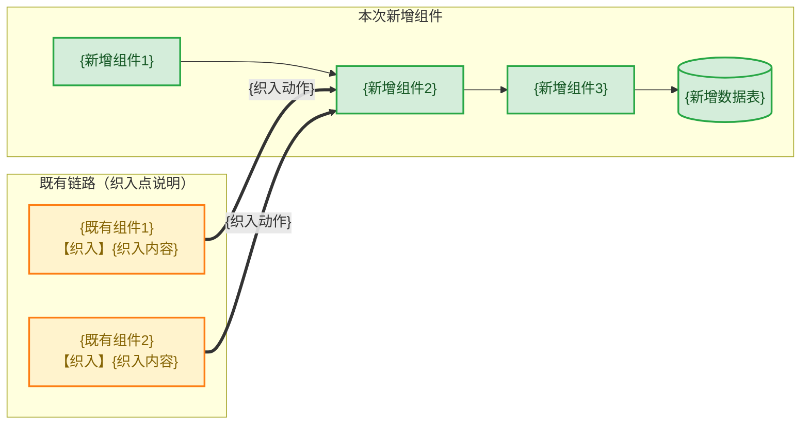

# {需求名} 需求代码检查报告

---

## 一、架构变更检查

### 1.1 本需求引入的架构变更

> 图例：🟩 绿色 = 本次新增组件；🟧 橙色 = 既有组件织入/修改点（加粗实线为织入边）；圆柱体为新增数据表。

| 维度 | 变更 | 评估 |
| --- | --- | --- |
| 分层架构 | {新代码落层情况} | ✅/⚠️/❌ {结论} |
| 对外接口 | {新增/变更接口及入口} | ✅/⚠️/❌ {结论，含资产沉淀位置} |
| 数据表 | {新增表/索引，多方言 DDL 同步情况} | ✅/⚠️/❌ {结论} |
| 关键数据结构 | {新增容器/缓存/队列} | ✅/⚠️/❌ {结论，含资产沉淀位置} |
| 既有代码织入方式 | {代码注入 vs Filter/拦截器} | ✅/⚠️/❌ {漏织入风险与重复注入评估} |
| 新增依赖 | {模块间新依赖方向} | ✅/⚠️/❌ {是否单向无环} |
| 可用性策略 | {逃生态/fail-open/降级等取舍} | ✅/⚠️/❌ {决策是否显式、运维影响} |
| 并发模型 | {锁/goroutine 模型} | ✅/⚠️/❌ {对照仓内既有并发隐患模式} |

### 1.2 架构资产同步状态

| 资产 | 路径 | 状态 |
| --- | --- | --- |
| 接口文档 | `docs/business/interface/...` | ✅/❌ {已同步内容或缺口} |
| feature 文档 | `docs/business/story/...` | ✅/❌ |
| 数据结构文档 | `docs/business/data-structure/...` | ✅/❌ |
| 关键类清单 | `docs/business/key-class/README.md` | ✅/❌ |
| 包结构文档 | `docs/architecture/module-structure/` | ✅/❌（无新增包则注明无需变更） |

**后续代码架构判断以 `docs/` 下资产为准**；缺口在下次资产刷新（spec-asset-refresh）时补齐。

---

## 二、Clean Code 逐项检查结果

### 2.1 合规项（无问题）

| # | 规范 | 结论 | 说明 |
| --- | --- | --- | --- |
| {规范编号} | {规范名} | ✅ | {关键证据，如"最长函数 X 38 行"} |

### 2.2 违规项（仅未整改交付时保留；整改后并入 2.1 并删除本节）

| # | 规范 | 位置 | 问题 | 建议修复方式 |
| --- | --- | --- | --- | --- |
| {规范编号} | {规范名} | `{文件:行号}` | {问题描述} | {修复建议} |

### 2.3 提示 / 豁免说明项

| # | 规范 | 位置 | 说明 | 判定 |
| --- | --- | --- | --- | --- |
| {规范编号} | {规范名} | `{文件:行号}` | {冲突/决策/存量延续说明} | **豁免/刻意设计/提示**：{判定依据} |

### 2.4 修改文件专项检查

| 文件 | 变更 | 结论 |
| --- | --- | --- |
| `{文件路径}` | {增量变更内容} | ✅/⚠️ {针对该文件增量部分的检查结论} |

---

## 三、结论与验证

### 结论

**{通过 / 通过（有改进项）}**。{一段话总结：硬性指标达标情况、架构对齐情况、豁免项依据充分性。}

### 验证结果

| 验证项 | 结果 |
| --- | --- |
| {编译命令} | ✅/❌ {结果} |
| {静态检查命令} | ✅/❌ {结果；存量报错注明与本需求无关} |
| {单元测试命令} | ✅/❌ {结果} |
| {集成测试} | ✅/❌ {用例清单与看护点通过数} |
