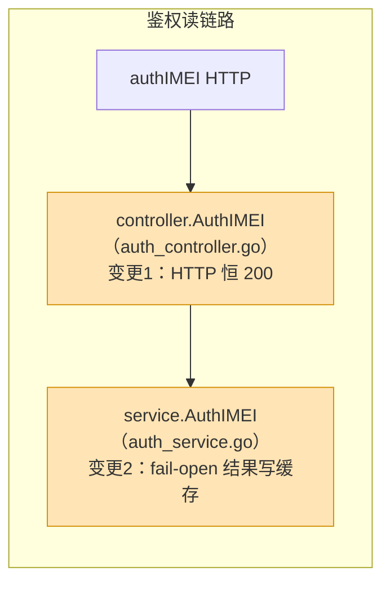
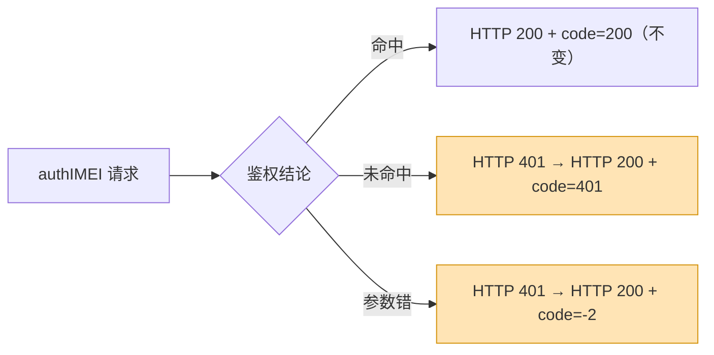

# develop-task 文档模板

抛弃式文档，聚焦辅助出代码。产出到 `<repo>/docs/1-storys/{功能名}/{功能名}-develop-task.md`（与 story 设计文档同目录）。不看排版、不写设计论证——设计细节在 story 设计文档里，本文档只回答"代码怎么改"。同名文件已存在时直接覆盖，不进 README 索引。

> 模板中所有具体内容（服务名、文件路径、文档链接、命令等）均为**格式示例**，产出时替换为目标仓实际内容。

````markdown
# <功能名> develop-task

## 1. 任务概述

<一两句话说清本需求做什么>。设计细节见 [story 设计文档]({功能名}-story.md)（同目录），本文档只管怎么改代码。

## 2. 变更总览

本次 N 处生产代码变更分布在 X 条链路上，变更框图如下（橙色为变更节点）：



**方案选型约束（业务逻辑正确性第一 + 正交四原则）**：每条修改点的实现逻辑必须立足存量代码现状（既有分层、校验与事务边界、并发与边界条件）设计；多种候选方案并存时优先业务逻辑正确、与既有架构一致的合理方案，禁止默认选改动最小的方案；禁止绕过既有校验/状态机、破坏事务一致性、忽略并发竞争、吞掉异常分支、错位分层（如业务逻辑塞进 Controller）等带逻辑缺口的写法。每条修改点同时不得违反正交四原则（DRY/SoC/最小化依赖/稳定依赖方向），确需违规时须经用户确认。

## 3. 逐变更点修改清单（逻辑链分析）

### 变更 1：controller.AuthIMEI —— authIMEI HTTP 恒 200（Q2 裁定）

**功能描述**：在新增 authIMEI「HTTP 恒 200」响应语义时，需将命中/未命中/参数错三档结果的 HTTP 状态统一为 200、业务结论下放到 body code，采用修改 `AuthIMEI` 函数实现"失败响应由 `c.Failed` 改为 `c.OK` + body code 区分"的逻辑（功能设计 §1.6 约束 1，Q2）。

**交互模型定位**：在 [authIMEI 鉴权交互模型](../../0-arch/interaction-model/interaction-model-auth-imei.md) 的基础上，修改「controller 响应写出」环节——三档结果统一 HTTP 200、body code 区分。

**对象/数据模型确认**：无新增对象/数据；采用既有 `BaseResponse` 响应对象（三档 code 契约见 interface-auth.md），实现"HTTP 恒 200、业务结论由 body code 表达"的应答功能。

**修改方案**：

1. **变更本质**：authIMEI 接口的应答方式变了——HTTP 状态不再表达业务结论，三档结论全部改由响应体 code 表达；接口入参与业务判定逻辑没变。
2. **变更示意图**：



3. **行为对照表**：

| 场景 | 现状行为 | 变更后行为 |
| --- | --- | --- |
| 命中白名单 | HTTP 200，body code=200 | 不变 |
| 未命中白名单 | HTTP 401 | HTTP 200，body code=401 |
| 参数缺失 / JSON 非法 | HTTP 401 | HTTP 200，body code=-2 |

4. **代码修改方案**（src/controllers/auth_controller.go）：

| 操作 | 逻辑 | 通过 | 实现 |
| --- | --- | --- | --- |
| 修改 | 参数错误应答逻辑 | `AuthIMEI`：`c.Failed` → `c.OK`（body code=-2） | 参数错误 HTTP 恒 200 |
| 修改 | 鉴权未通过应答逻辑 | `AuthIMEI`：`c.Failed` → `c.OK`（body code=401） | 未命中 HTTP 恒 200 |
5. **边界与约束**：成功路径不变；登录/事件链路拒绝行为不改（Q2 边界）。

**参考资产**：

| 参考文件 | 引用内容 |
| --- | --- |
| [interface-auth.md](../../0-biz/interface/interface-auth.md) | authIMEI 三档 code（200/401/-2）响应契约 |
| [rules-auth.md](../../0-biz/rules/rules-auth.md) | 鉴权拒绝与参数错误的分支规则口径 |
| [framework-guidelines-beego.md](../../0-tech/framework-guidelines/framework-guidelines-beego.md) | BaseController.OK/Failed 统一响应出口约定 |

**看护测试**：testsuit/TC_002.py（三档 HTTP 200 + body code 断言）。

### 变更 2：……（按变更 1 的字段结构逐点展开）

### 测试改动清单

| 文件 | 操作 | 修改点与实现逻辑 |
|------|------|-----------------|
| src/service/auth_service_test.go | 新增 N 个 Test 函数 | 用例要点（标注看护哪个变更，如：看护变更 2/3） |
| testsuit/TC_001.py | 修改/新增步骤 | 断言对齐要点（标注看护哪个变更） |

## 4. 验证方式

- DT 测试：<测试文件规划，按仓内存量测试约定搭建>
- 集成测试：<仓内集成/E2E 测试脚本或手工验证步骤，含前置条件敏感性说明，无则写"无">
- 验证命令：<按仓语言与构建工具填写，如 go build ./... && go test ./...、mvn verify、pytest>

## 5. 编码工作流提示

- TDD：先写测试再写实现，红灯→绿灯→重构
- 宣称完成前必须运行验证命令，用证据支撑"已完成"
- 遇 bug / 测试失败：先定位根因再改，禁止试凑式修改

## 6. 澄清问题列表

| 编号 | 疑问描述 | 涉及源码位置 | 用户澄清结论 |
|------|---------|-------------|-------------|
| Q1 | <一句话疑问描述> | <文件路径:函数名> | <用户澄清结论，决定本需求采用哪个方案> |

记录第 5.2 步提交用户的疑问点与用户澄清结论。无疑问点时本节写"无疑问点"。
````
