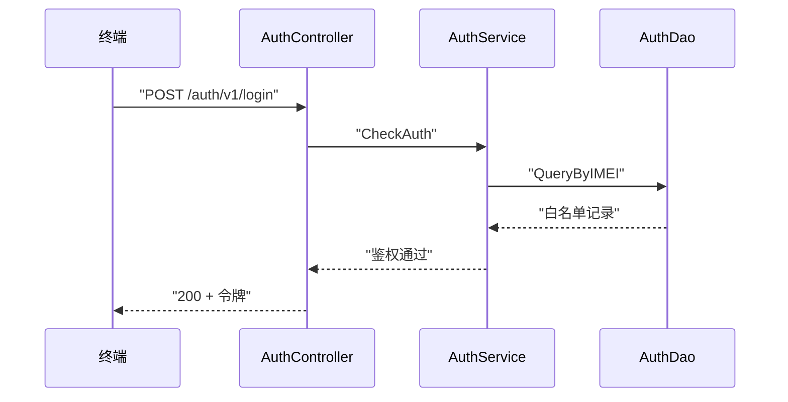

# <流程名> 业务流程

> 最近更新：<梳理触发来源>，YYYY-MM-DD

## 1. 流程概述

<1~3 句：业务目标、触发者、参与角色>。例：终端发起登录请求，GIDS 鉴权服务校验凭证合法性，通过后建立会话并下发令牌。

## 2. 触发条件与前置条件

- 触发条件：<什么情况下本流程启动，如"终端 POST /auth/v1/login">
- 前置条件：<启动前必须满足的条件，如"终端凭证已在白名单中注册">

## 3. 主流程

| 步骤 | 动作 | 责任模块 | 代码位置 |
|------|------|---------|---------|
| 1 | 接收登录请求，解析参数 | controllers | controllers/auth_controller.go Login |
| 2 | 校验凭证合法性 | service | service/auth_service.go CheckAuth |
| 3 | 查询白名单记录 | dao | dao/auth_dao.go QueryByIMEI |
| 4 | 建立会话并返回令牌 | service | service/session_service.go Create |

## 4. 分支与异常处理

| 条件/异常 | 处理路径 | 代码位置 |
|----------|---------|---------|
| 凭证不在白名单 | 返回 -2 拒绝，不建立会话 | service/auth_service.go CheckAuth |
| DB 查询失败 | 走逃生策略：按内存缓存判定 | service/auth_service.go fallbackCheck |
| 参数缺失 | Controller 层直接返回参数错误 | controllers/auth_controller.go Login |

## 5. 涉及实体与状态变更

| 实体/存储 | 操作 | 状态变更 |
|----------|------|---------|
| AuthWhitelist（DB 表） | 读 | 无 |
| 会话缓存（内存） | 写 | 无会话 → 已登录 |
| <状态机实体> | 读写 | 状态 A → 状态 B（触发：<条件>）；状态 B → 状态 A（触发：<条件>） |

## 6. 代码映射

| 角色 | 文件 | 函数/类 |
|------|------|--------|
| 入口 | routers/router.go | 注册 POST /auth/v1/login |
| 接入层 | controllers/auth_controller.go | AuthController.Login |
| 业务层 | service/auth_service.go | AuthService.CheckAuth |
| 数据层 | dao/auth_dao.go | AuthDao.QueryByIMEI |

## 7. 外部交互

| 方向 | 对象 | 交互内容 | 文档链接 |
|------|------|---------|---------|
| 上游 | 终端 | 发起登录请求 | 无 |
| 下游 | 沐恩云服务 | POST /auth/v1/verify 校验设备 | [external-call-munen.md](../external-call/external-call-munen.md#auth-verify) |

无外部交互时本节写"无"；docs/external-call/ 不存在时列出交互对象并注明"无出站调用文档，待核实"。
