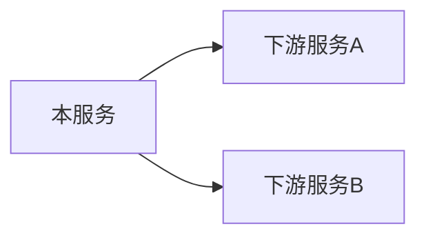

| 元信息 | 值 |
|--------|-----|
| 代码仓 | <仓库名> |
| 分析基准 | <分支名> 分支 (<YYYY-MM-DD>) |
| 更新时间 | <YYYY-MM-DD> |
| Skill | spec-external-call-analyze |
| 主要语言 | <语言> |
| 出站协议 | <命中的协议类型，如 HTTP / gRPC / Kafka> |

## 外部服务全景

| 服务名 | 协议 | 接口数 | 主要业务域 | 归属判定依据 |
|---|---|---|---|---|
| <服务名> | <协议> | <N> | <业务域> | <显式服务名 / 配置映射 / 上下文推断> |

## 附注

- 死代码（客户端封装存在但无任何业务调用方）：<逐条列出，无则写"无">
- 配置声明但代码中无实际调用的下游：<逐条列出，无则写"无">
