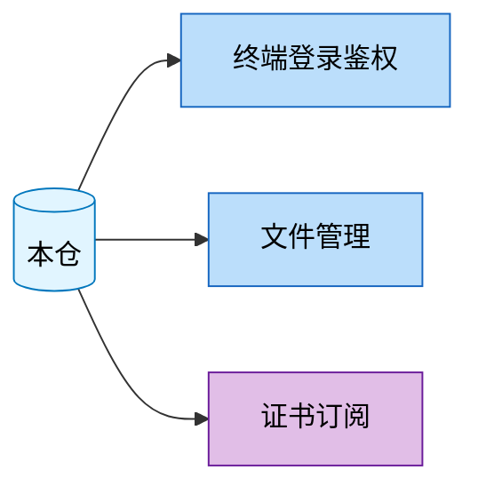

# 对外接口总览

| 元信息 | 值 |
|--------|-----|
| 代码仓 | <仓库名> |
| 分析基准 | <分支名> 分支 (<YYYY-MM-DD>) |
| 更新时间 | <YYYY-MM-DD> |
| Skill | spec-interface-analyze |
| 主要语言 | <语言> |
| Web 框架 | <框架及版本> |
| API 契约 | <契约文件类型与数量，无则写"无"> |

> 面向人类阅读。范围：本仓对外提供的接口（HTTP 路由 / RPC service / 消息订阅 handler / IDL 契约），不含本仓调用别人的接口。

## 1. 接口全景

一张 mermaid 图：本仓为中心节点，指向各功能域；功能域节点按业务功能命名。

统计：共 **N** 个功能域，**N** 个对外接口（HTTP X / RPC Y / 消息订阅 Z / 定时任务 W）。

## 2. 功能域索引

| 功能域 | 接口数 | 核心模块 | 子文档 |
|---|---|---|---|
| 终端登录鉴权 | 3 | controllers/exlogin, controllers/login | [spec-interface-login.md](spec-interface-login.md) |
| 文件管理 | 8 | controllers/exfile, controllers/file | [spec-interface-file-mgmt.md](spec-interface-file-mgmt.md) |
| 证书订阅 | 3（异步） | common/cert | [spec-interface-cert.md](spec-interface-cert.md) |

> 未归类接口：无（若有探测到但无法归入任何功能域的接口，在此逐条列出并说明原因）

自检：扫描 N 个接口，已记录 N 个，未归类 M 个（见上表），差集已清零（YYYY-MM-DD）

## 3. 全局风险与注意点

跨功能域的共性风险，每条带 `文件:行号` 证据：

- **全局中间件**：routers/beego_router.go:19（OverLoadFilter 全局限流，所有接口共用）
- **双 server 架构**：routers/beego_router.go:17/28（externalServer HTTPS + innerServer HTTP，同接口双暴露）

（无风险点时此节可省略，但需在全景图后注明"未发现显著风险点"）
