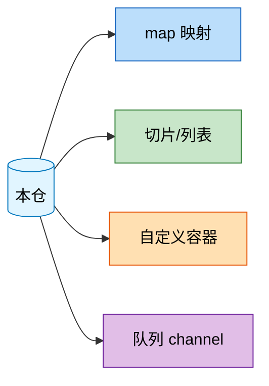

# 关键数据结构总览

| 元信息 | 值 |
|--------|-----|
| 代码仓 | <仓库名> |
| 分析基准 | <分支名> 分支 (<YYYY-MM-DD>) |
| 更新时间 | <YYYY-MM-DD> |
| Skill | spec-data-structure-analyze |
| 主要语言 | <语言> |

> 面向人类阅读。范围：本仓承载关键业务/自定义/高被引用/特殊并发语义的数据结构，不含一次性局部变量与生成代码。

## 1. 数据结构全景

一张 mermaid 图：本仓为中心节点，指向各数据结构类型；类型节点按类型配色。

统计：共 **N** 个类型，**N** 个关键数据结构实例（array X / slice Y / map Z / set W / 自定义容器 V ...）。

## 2. 类型索引

| 类型 | 实例数 | 核心用途 | 子文档 |
|---|---|---|---|
| map | 5 | 缓存表/注册表/会话池 | [spec-data-structure-map.md](spec-data-structure-map.md) |
| slice | 3 | 批量缓冲/采样窗口 | [spec-data-structure-slice.md](spec-data-structure-slice.md) |
| custom-container | 2 | LRU 缓存/连接池 | [spec-data-structure-custom-container.md](spec-data-structure-custom-container.md) |
| set | 0 | — | 未发现（已排查） |

> 未归类实例：无（若有探测到但无法归入任何类型的实例，在此逐条列出并说明原因）

自检：扫描 N 个实例，已记录 N 个，未归类 M 个（见上表），差集已清零（YYYY-MM-DD）

## 3. 全局风险与注意点

跨类型的共性风险，每条带 `文件:行号` 证据：

- **并发安全 map 封装**：models/cache.go:23（Cache struct 内嵌 RWMutex + map，新增字段须沿用同款封装）
- **全局注册表生命周期**：routers/router.go:15（var handlers 全局 map，无显式 unregister，长期运行内存增长风险）

（无风险点时此节可省略，但需在全景图后注明"未发现显著风险点"）
